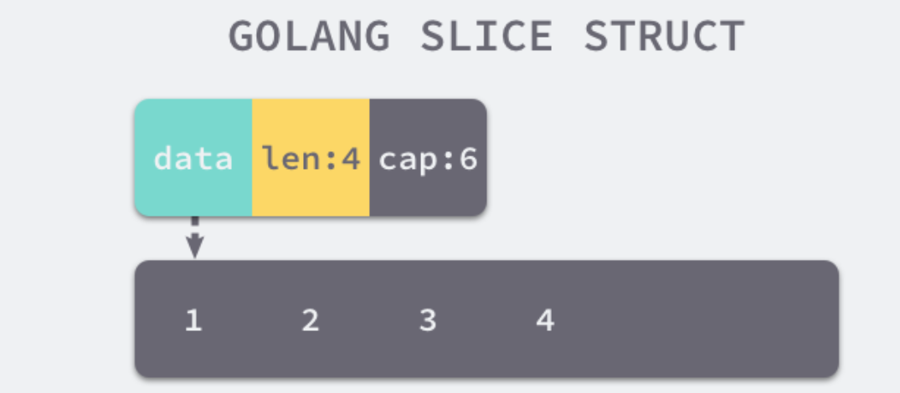

> 如需转载，请附上链接：[https://jwcen.github.io/](https://jwcen.github.io/)
{: .prompt-tip}

* This will become a table of contents (this text will be scrapped).
{:toc}

## 指针类型
- `*` 类型: 普通指针类型，**用于传递对象地址，不能进行指针运算。**
- `unsafe.Pointer`: 通用指针类型，**用于转换不同类型的指针，不能进行指针运算，不能读取内存存储的值**（必须转换到某一类型的普通指针）。
- `uintptr`: (是一个整数类型) **用于指针运算**，GC 不把 `uintptr` 当指针，`uintptr` 无法持有对象。`uintptr` 类型的目标会被回收。

总结：`unsafe.Pointer` 可以让你的变量在不同的普通指针类型转来转去，也就是表示为任意可寻址的指针类型。而 `uintptr` 常用于与 `unsafe.Pointer` 打配合，用于做指针运算。

更多详情，浏览[相关文档](https://devdocs.io/go/unsafe/index#Pointer)。

## string
Go 语言中的字符串只是一个只读的字节数组, 如果是代码中存在的字符串，编译器会将其标记成只读数据 `SRODATA`。  
只读只意味着字符串会分配到只读的内存空间， Go 语言只是不支持直接修改 `string` 类型变量的内存空间，但可以通过在 `string` 和 `[]byte` 类型之间反复转换实现修改。
> `[]byte` 和 `string` 互转：需要一次内存拷贝(拷贝到堆或者栈上)

数据结构如下：
```go
type StringHeader struct {
    Data uintptr  // 指向字节数组的指针 8字节
    Len  int      // 数组的大小 8字节
}
```

### Unicode 和 UTF-8
这个得从字符集说起了。。。
- 字符集：是一个从人类语言到二进制编码的映射表。
- ASCII：最早的字符集，ASCII 字符集中，字母 A 对应的字符编码是 65
  - 缺点：没有涵盖西文字母之外的字符
  - 几乎每种语言都需要有一个自己的字符集，且互补兼容，乱码
- Unicode字符集：包含了世界上所有文字和符号，统一编码，来终结不同编码产生乱码的问题。
  - 字符集只是给所有的字符一个唯一编号，但是却没有规定如何存储
- UTF8变长编码：UTF-8 代表 8 位一组表示 Unicode 字符的格式，使用 1 - 4 个字节来存储字符。
- 编码：字符--编码-->unicode（内存中）--编码-->utf-8\gbk（硬盘中）...
- 解码：字符--解码<--unicode（内存中）--解码<--utf-8\gbk（硬盘中）...

### rune 和 byte 类型
- `byte：``unit8` 类型的别名，表示UTF-8字符串的单个字节的值
- `rune`：等同于 `int32` 类型，在 Go 中表示单个Unicode字符。因为Go的字符串是utf-8编码，其底层用4个字节表示，也就是 32bit

### 拼接
Go 的 `string` 是不可变的，拼接字符串事实上是**创建了一个新的字符串对象**。如果代码中存在大量的字符串拼接，对性能会产生严重的影响。

常见拼接方式：
- `+`
- `fmt.Sprintf`
- `strings.Builder`
- `bytes.Buffer`
- `[]byte`


总结：
- 字符串最高效的拼接方式是**结合预分配内存方式 `Grow` 使用 `string.Builder`**
- 当使用 `+` 拼接字符串时，生成新字符串，**需要开辟新的空间**
- 当使用 `strings.Builder`，`bytes.Buffer` 或 `[]byte` 的内存是**按倍数申请**的，在原基础上不断增加
- `strings.Builder` 比 `bytes.Buffer` 性能更快，一个重要区别在于 `bytes.Buffer` 转化为字符串**重新申请了一块空间**存放生成的字符串变量；而 `strings.Builder` 直接将底层的 `[]byte` 转换成字符串类型返回


## 数组和 slice

~~~go
// 创建数组
arr := [5]int{1,2,3,4,5}
arr2 := [...]int{1, 2, 3, 4,5} // 在编译期间就会被转换成前一种

// 根据数组创建切片
s1 := arr[1:3]
// 根据字面量创建切片
s2 := []int{1,2,3}  // 1.先创建数组，2再通过runtime.newboject()创建slice结构体，把数据填进去
// 根据make方法创建切片
s3 := make([]int, 5)   // 底层调用runtime.makeslice()方法

slice[start:end:cap]
// 剩余cap = cap - start
len(slice) = end - start
~~~


### 区别
- 数组类型定义了长度`bound`和元素类型`elem`。长度固定，且为数组类型一部分。
- 切片，动态数组，其长度不固定且与类型无关，可以向切片中追加元素，容量不足时会自动扩容。
  - 本质是一个数组片段的描述，包括了数组的指针，该片段的长度和容量
  - {: width="300", height="200"}
- 数组的大小在编译期确定，而切片的大小是在运行时确定的（切片所有操作还需要依赖 Go 语言的运行时）。
- Go函数传参只有值传递。
  - Go 中，数组变量属于值类型，它被赋值或者传递时，实际上会复制整个数组。（内存开销大）
  - 切片是引用类型，将一个切片变量分配给另一个变量只会复制三个字段，复用原来切片的底层数组。（高效）

### 切片扩容
当切片的容量不足时，`runtime` 会调用 `growslice` 函数为切片扩容，扩容是为切片**分配新的内存空间并拷贝原切片**中元素的过程。
在分配内存空间之前需要**先确定新的切片容量**，运行时根据切片的当前容量选择不同的策略进行扩容：
- Go1.17及其之前：
  - 如果期望容量大于当前容量的两倍就会使用期望容量；
  - 如果当前切片的长度小于 1024 就会将容量翻倍；
  - 如果当前切片的长度大于 1024 就会每次增加 25% 的容量，直到新容量大于期望容量；
- Go1.18后：把阈值1024改为了256

这个只是确定切片的大致容量，下面还需要根据切片中的元素大小**对齐内存**，当数组中元素所占的字节大小为 1、8 或者 2 的倍数时，运行时会使用如下所示的代码对齐内存：

~~~go
var overflow bool
	var lenmem, newlenmem, capmem uintptr
	switch {
	case et.size == 1:
		lenmem = uintptr(old.len)
		newlenmem = uintptr(cap)
		capmem = roundupsize(uintptr(newcap))
		overflow = uintptr(newcap) > maxAlloc
		newcap = int(capmem)
	case et.size == sys.PtrSize:
		lenmem = uintptr(old.len) * sys.PtrSize
		newlenmem = uintptr(cap) * sys.PtrSize
		capmem = roundupsize(uintptr(newcap) * sys.PtrSize)
		overflow = uintptr(newcap) > maxAlloc/sys.PtrSize
		newcap = int(capmem / sys.PtrSize)
	case isPowerOfTwo(et.size):
		...
	default:
		...
	}
~~~


`runtime.roundupsize` 函数会将待申请的内存向上取整；进行内存对齐后，取整时会使用 `runtime.class_to_size` 数组，使用该数组中的整数可以提高内存的分配效率并减少碎片。所以新 slice 的容量会大于等于 按照扩容规则生成的 newcap。


~~~go
var class_to_size = [_NumSizeClasses]uint16{
    0,
    8,
    16,
    32,
    48,
    64,
    ...,
}

// ...
var arr []int64
arr = append(arr, 1, 2, 3, 4, 5)
/*
简单总结一下扩容的过程，
当执行上述代码时，会触发 runtime.growslice 函数扩容 arr 切片并传入期望的新容量 5，
这时期望分配的内存大小为 40 字节 = 元素个数x元素大小；
不过因为切片中的元素大小等于 sys.PtrSize，
所以运行时会调用 runtime.roundupsize 向上取整内存的大小到 48 字节，
所以新切片的容量为 48 / 8 = 6。
*/
~~~


### 切片操作与性能

~~~go
a := []int{1, 2, 3, 4, 5}
b := make([]int, len(a)) 
// 深拷贝，以下3种效果同
copy(b, a) 
b = append([]int(nil), a...) 
b = append(a[:0:0], a...)

// 浅拷贝
b = a 
b = a[:] 
~~~



为了避免内存发生拷贝，如果能够知道最终的切片的大小，预先设置 cap 的值能够获得最好的性能。
~~~go
a = append(a, b...)
~~~



底层是数组，因此删除意味着后面的元素需要逐个向前移位。每次删除的复杂度为 O(N)，因此切片不合适大量随机删除的场景，这种场景下适合使用链表。
~~~go
// 删除第 i 个元素
a = append(a[:i], a[i+1:]...)
copy(a[:i], a[i+1:])

// 删除后，将空余的位置置空，有助于垃圾回收。
a[len(a)-1] =  nil 
a = a[:len(a)-1]
~~~


### nil切片和空切片
> nil是为 `pointer`、`channel`、`func`、`interface`、`map`或`slice`类型预定义的标识符，代表这些类型的零值。  



~~~go
// nil切片。未初始化，nil值，底层未分配空间，和nil比较为true
// 指向的引用数组地址为 0，可以理解是一个无效地址
var nilSlice []int  

// 空切片。初始化了，非nil值，底层分配了空间， 和nil比较false
// 指向的引用数组地址是一个固定值
slice := make([]int, 0)
slice := []int{}
~~~

对nil切片调用内置函数 append、len 和 cap 的效果都是一样的。

 

----
参考
- Go 语言程序设计
- Go 高性能编程

> 如需转载，请附上链接：[https://jwcen.github.io/](https://jwcen.github.io/)
{: .prompt-tip}