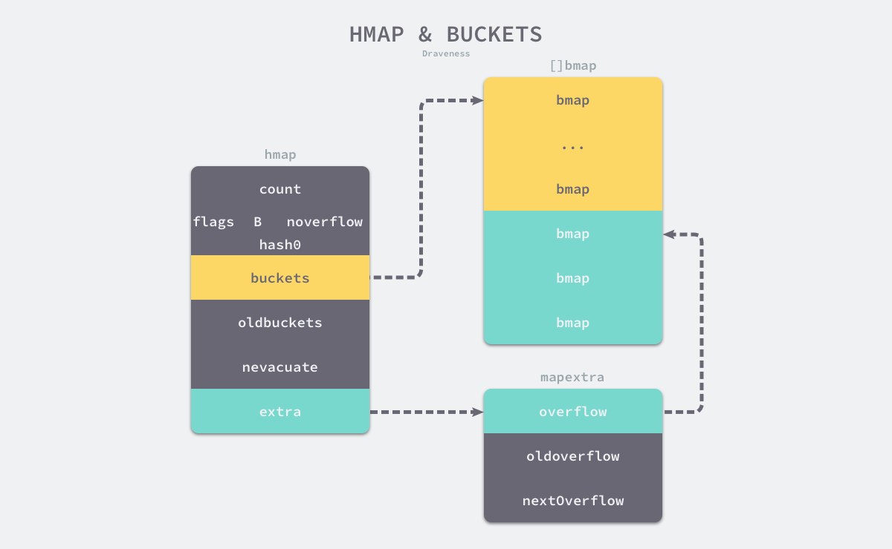
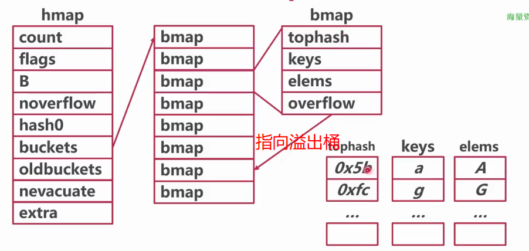
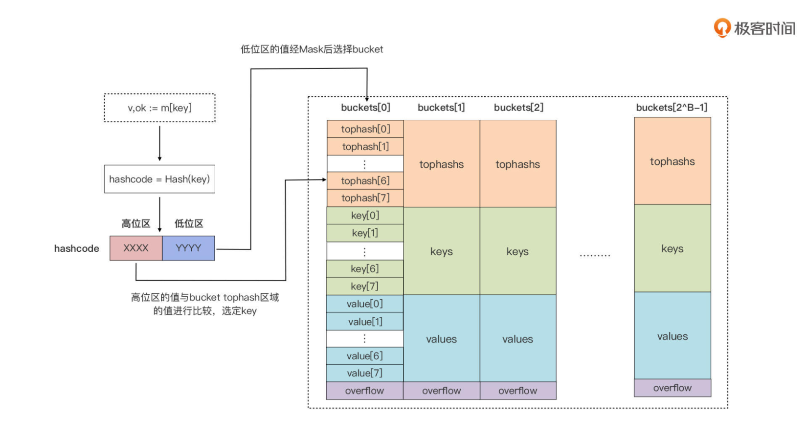
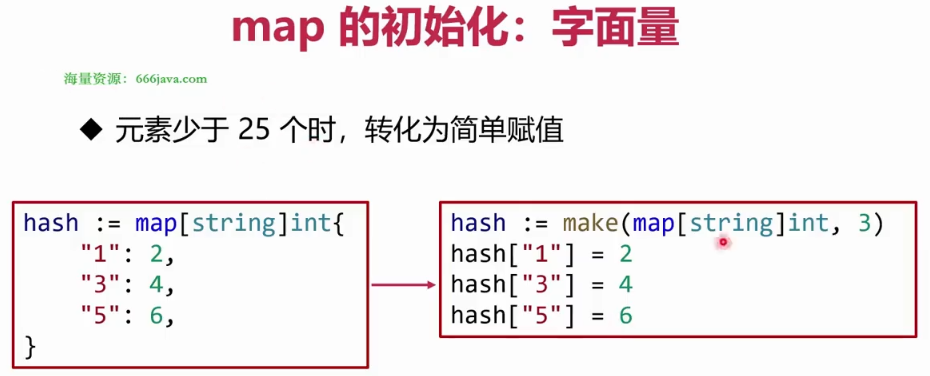
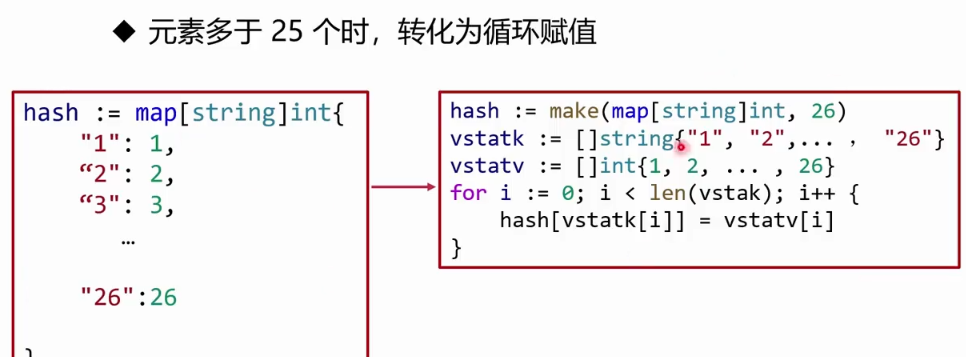
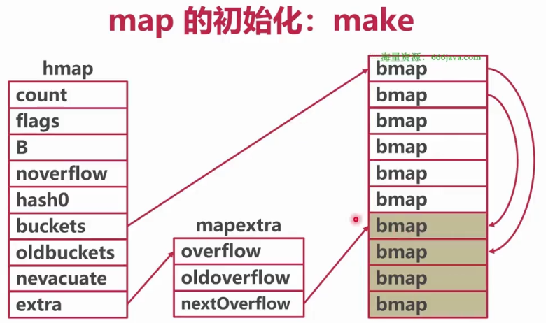
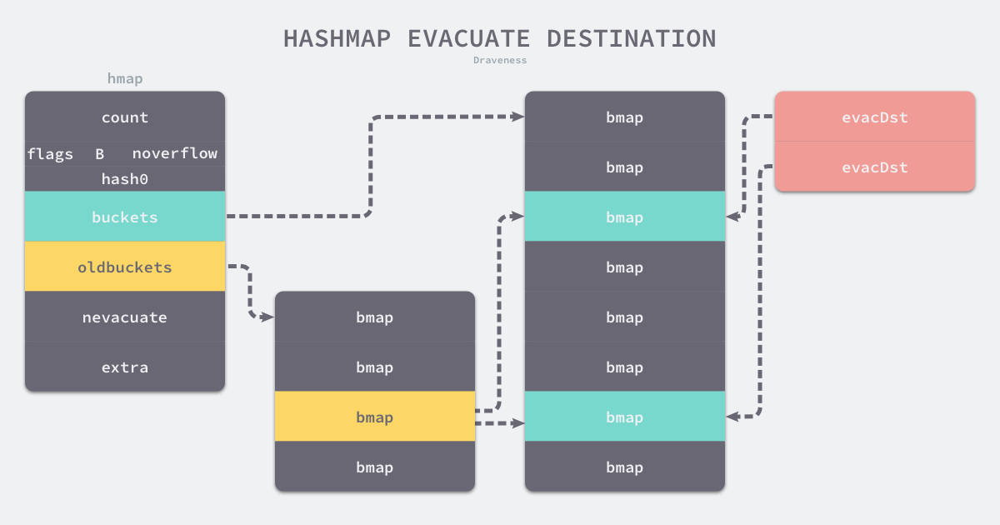

> 如需转载，请附上链接：[https://jwcen.github.io/](https://jwcen.github.io/)
{: .prompt-tip}

* This will become a table of contents (this text will be scrapped).
{:toc}

Go 中的 `map` 是一种数据类型，将键与值绑定到一起，底层是用**哈希表**实现的，可以快速的通过键找到对应的值。
- 哈希表，本质就是一个数组，使用了一个哈希函数将 `key` 分配到不同的桶（`bucket`, 即数组的不同 `index`）。故开销主要在哈希函数的计算以及数组的常数访问时间 $O(1)$。
- 存在哈希碰撞问题（不同的 key 被哈希到同一个桶）解决：链表法

## 数据结构
底层是一个指向 `hmap` 结构体的指针，占8个字节，主要是由三个结构构成:
- `hmap` --- `map` 的最外层的数据结构，包括了`map`的各种基础信息、如大小、`buckets`等。
- `mapextra` --- 记录`map`的额外信息，`hmap`结构体里的可选字段`extra`指针指向的结构，例如 `overflow bucket`
- `bmap` --- 代表 `buckets` 中的 `bucket`.
  - 一个`bucket`可分为3部分：`tophash`, `keys/values`, `overflow` 指针，一个桶最多放`8`个kv，最后由一个`overflow`字段指向下一个`bmap`.
  - 注意`key`、`value`、`overflow`字段都不显示定义，而是通过`maptype`计算偏移获取的。




~~~go
type hmap struct {
    count     int  //  map 中的键值对个数
    flags     uint8 // 状态标识，主要是 goroutine 写入和扩容机制的相关状态控制。并发读写的判断条件之一就是该值
    B         uint8 // 桶的数量 = 2^B
    noverflow uint16  // 溢出桶的数量
    hash0     uint32  // 哈希因子
    buckets    unsafe.Pointer // buckets数组指针指向由若干个bucket组成的数组
    oldbuckets unsafe.Pointer // 保存旧桶的指针地址
    nevacuate  uintptr // 迁移进度
    extra *mapextra
}

type mapextra struct {
    overflow    *[]*bmap // （当前）溢出桶的指针地址
    oldoverflow *[]*bmap // （旧）溢出桶的指针地址
    nextOverflow *bmap   // 为空闲溢出桶的指针地址
}

type bmap struct {
    tophash [bucketCnt]uint8 // key高八位
    // keys 
    // values
    // overflow 下一个溢出桶的指针地址（当 hash 冲突发生时）
}
~~~



_hmap_
_bmap_


- `tophash`
  - 长度为 8 的数组，代指桶最大可容纳的键值对为 8。
  - 存储每个元素 `hash` 值的高 8 位，如果 `tophash[0] <minTopHash`，则 `tophash[0]` 表示为迁移进度
  - 作用：进行迭代时快速定位key，这样不用完整比较`key`就能过滤掉不符合的`key`

- `keys` 和 `values`
  - `tophash` 区域下的一块连续内存区域
  - 通过`maptype`中的信息确定 `key` 类型和大小
- `overflow`
  - 当 `hmap.buckets` 满了后，就会使用溢出桶接着存储

> Go运行时把 `key`，`value` 分开存储，`k/k/k/v/v/v`，为什么？
{:.prompt-tip}  
- 如果用 `k/v/k/v` 方式存储，若每个键值对的值都只占用 1 个字节, 但是却需要 7 个填充字节来补齐内存空间; `k/k/k/v/v/v` 算法复杂高了，但**减少了因内存对齐的内存浪费**
- 当 `key` 大于 128 字节时，`bucket` 的 `key `字段存储的会是指针，指向`key`的实际内容；`value`也是一样。

## 初始化
 Go 语言初始化哈希的两种方法 — 通过字面量和运行时。  

- 
- 






无论哪种方法，最后调用的都是 `runtime.makemap`：

~~~go
func makemap(t *maptype, hint int, h *hmap) *hmap {
	mem, overflow := math.MulUintptr(uintptr(hint), t.bucket.size)
	if overflow || mem > maxAlloc {
		hint = 0
	}

	if h == nil {
		h = new(hmap)
	}
	h.hash0 = fastrand()

	B := uint8(0)
	for overLoadFactor(hint, B) {
		B++
	}
	h.B = B

	if h.B != 0 {
		var nextOverflow *bmap
		h.buckets, nextOverflow = makeBucketArray(t, h.B, nil)
		if nextOverflow != nil {
			h.extra = new(mapextra)
			h.extra.nextOverflow = nextOverflow
		}
	}
	return h
}
~~~

- 计算能分配内存的最大值；
- 初始化`hmap`，设置一个随机的哈希种子；
- 根据传入的 `hint` 计算一个可以放下`hint` 个元素的桶 B 的最小值；
- 如果 `B` 为 0 将在后续懒惰分配桶，大于 0 则会马上进行分配;
- 使用 `makeBucketArray` 根据传入的 `B` 计算出的需要创建的桶数量；
  - 当桶数量$<2^4$，由于数据较少、使用溢出桶的可能性较低，会省略创建的过程以减少额外开销；
  - 当桶的数量多于$2^4$, 会预先额外创建一些溢出桶 $2^{B-4}$ 个；
  
- 返回初始化完毕的 `hmap`.


## 读写操作
### 访问
实现 `map` 元素访问上的方法
```go 
v     := hash[key] // => v     := *mapaccess1(maptype, hash, &key)
v, ok := hash[key] // => v, ok := mapaccess2(maptype, hash, &key)
```  


~~~go
func mapaccess1(t *maptype, h *hmap, key unsafe.Pointer) unsafe.Pointer {
    alg := t.key.alg
    hash := alg.hash(key, uintptr(h.hash0))
    m := bucketMask(h.B)
    b := (*bmap)(add(h.buckets, (hash&m)*uintptr(t.bucketsize)))
    top := tophash(hash)
bucketloop:
    for ; b != nil; b = b.overflow(t) {
        for i := uintptr(0); i < bucketCnt; i++ {
            if b.tophash[i] != top {
                if b.tophash[i] == emptyRest {
                    break bucketloop
                }
                continue
            }
            k := add(unsafe.Pointer(b), dataOffset+i*uintptr(t.keysize))
            if alg.equal(key, k) {
                v := add(unsafe.Pointer(b), dataOffset+bucketCnt*uintptr(t.keysize)+i*uintptr(t.valuesize))
                return v
            }
        }
    }
    return unsafe.Pointer(&zeroVal[0])
}
~~~


`runtime.mapaccess2` 多返回了一个标识键值对是否存在的 bool 值。


1. 判断。
   - `map` 是否为 `nil`, 长度是否为 0. 若是返回类型的零值。
   - 当前是否并发读写 `map`, 若是抛出异常。
2. 通过哈希表设置的哈希函数得到当前 `key` 的哈希值。（另外会计算出 `hash` 值的高八位和低八位。）
3. 通过 `runtime.bucketMask` 和 `runtime.add` 确定这个键值对所在的**桶序号**和**哈希高 8 位数字**。
4. 判断是否正在发生扩容（`h.oldbuckets` 是否为 `nil`），若正在扩容，则到旧的 `buckets` 中查找（因为 `buckets` 中可能还没有值，搬迁未完成），若该 `bucket` 已经搬迁完毕。则到 `buckets` 中继续查找
5. 根据计算出来的 `tophash`，依次循环对比 buckets 的 `tophash` 值（快速试错）
6. 如果 `tophash` 匹配成功，会通过**指针和偏移量**获取哈希中存储的键 `keys[0]` 并与传入的 `key` 比较，如果相同就返回**目标值的指针** `values[0]` 并返回。

> 低八位会作为 `bucket index`，作用是用于找到 `key` 所在的 `bucket`。
> 而高八位会存储在 `bmap` 的 `tophash` 中，**用于加速访问。**
>  - 能够减少同一个桶中有大量相等 tophash 的概率影响性能

### 写入/赋值

```go 
m = make(map[int]int)
m[0] = 666
// m[k] 表达式出现在赋值符号左侧时，
// 该表达式也会在编译期间转换成 runtime.mapassign 函数的调用
```

1. 判断。
   - `hmap` 是否已经初始化（是否为 `nil`）
   - 当前是否并发读写 `map`, 若是抛出异常。
2. 通过哈希表设置的哈希函数得到当前 `key` 的哈希值。（另外会计算出 `hash` 值的高八位和低八位。）
3. 设置 `flags` 标志位，表示有一个 goroutine 正在写入数据。因为 alg.hash 有可能出现 panic 导致异常。
4. 根据低八位计算得到 `bucket` 的内存地址，并判断是否正在扩容，若正在扩容中则**先迁移**再接着处理。
5. 然后通过遍历比较桶中存储的 `tophash` 和传入键的高8位，是否一致。
6. 若不一致，判断是否为空槽。若是空槽（有两种情况，第一种是**没有插入过**。第二种是**插入后被删除**），则**把该位置标识为可插入 tophash 位置。** 注意，这里就是第一个可以插入数据的地方。
7. 一致的话就比较桶里的`key`和传入的`key`，不匹配则跳过，匹配（也就是原本已经存在），则进行更新。最后跳出并返回 `value` 的内存地址。
8. 迭代完毕，会更新当前桶位置。
9. 如果满足扩容条件，会进行扩容。
10. 在这个迭代过程中，若没有找到可插入的位置，意味着当前的所有桶都满了，将重新分配一个新溢出桶用于插入动作。
11. 最后再在上一步申请的新插入位置，存储键值对，返回该值的内存地址。

> 最后为什么是返回内存地址？
{: .prompt-info}

因为隐藏的最后一步**写入动作（将值拷贝到指定桶）**是通过编译期间底层汇编配合来完成的，在 `runtime` 中只完成了绝大部分的动作。

### 删除
哈希表的删除逻辑与写入逻辑很相似，只是触发哈希的删除需要使用关键字`delete`, 如果在删除期间遇到了哈希表的扩容，就会分流桶中的元素，分流结束之后会找到桶中的目标元素完成键值对的删除工作。

### 扩容
#### 什么时候扩容
```go 
if !h.growing() && (overLoadFactor(h.count+1, h.B) || tooManyOverflowBuckets(h.noverflow, h.B)) {
    // ...
    hashGrow(t, h)
    goto again
    // ...
}
```
条件：
1. 装载因子已经超过 6.5；
   -   即平均每个 `bucket` 存储的键值对达到6.5个。
2. 哈希使用了太多溢出桶；
   - 数量 > $2^{15}$

> 负载因子 = 键数量 / `bucket`数量

#### 1. 确定扩容规则
根据触发的条件不同扩容的方式分成两种：
- 溢出桶过多导致，就是等量扩容 `sameSizeGrow`
- 负载因子超过界限导致的，就是增量扩容

等量扩容：分配跟原桶相同大小的空间，重做一遍类似增量扩容的迁移操作，**把松散的键值对重新排列一遍**，使得同一个`bucket`中`key`排列更加紧密，从而节省空间、提高bucket利用率、保证更快的存取。

> 为什么要增量扩容呢？  
> 主要是缩短 `map` 的响应时间。  
> - 假设当前 `hmap` 的容量比较大，直接全量扩容的话，就会导致扩容要花费大量的时间和内存，导致系统卡顿，最直观的表现就是慢。
{: .prompt-tip}

> 为什么会等量扩容呢？  
> - 极端场景，比如不断进行增删，而键值对正好集中在一小部分的 `bucket`，这样会造成溢出表数量增多，但负载因子又不高，从而无法执行增量搬迁的情况
> - 此时进行一次等量扩容，经过重新组织后，溢出表的数量会减少，即节省了空间又会提高访问效率
{: .prompt-tip}


#### 2. 初始化、交换新旧 桶/溢出桶
> 主要是针对扩容的相关数据前置处理，涉及 `buckets/oldbuckets`、`overflow/oldoverflow` 之类与存储相关的字段

#### 3. 扩容阶段

扩容的入口是 `hashGrow`：  
- 哈希在扩容过程通过 `makeBucketArray` 创建一组新桶和预创建的溢出桶
- 随后将原有桶数组 `buckets` 设置到 `oldbuckets` 上
- 并将新的空桶设置到 `buckets` 上，溢出桶也使用了相同的逻辑更新

该函数中**只是创建了新的桶，并没有对数据进行拷贝和转移。** 实际的搬迁操作通过 `growWork` 和 `evacuate` 函数完成。
- `evacuate` 会将一个旧桶中的数据**分流到两个新桶**
- 它会创建两个用于保存分配上下文的 `evacDst` 结构体，分别都指向了一个新桶。



如果这是等量扩容，那么旧桶与新桶之间是一对一关系，两个 `evacDst` 只会初始化一个。  
而当哈希表的容量翻倍时，每个旧桶的元素会都分流到新创建的两个桶中。

当分流完毕后，需要迁移的数据都会通过 `typedmemmove` 函数迁移到指定的目标桶上。

`evacuate` 最后会调用 `advanceEvacuationMark` **增加哈希的 `nevacuate` 计数器**，并在所有旧桶都被分流后**清空哈希**的 `oldbuckets` 和 `oldoverflow`.


## map 相关问题
### map 使用注意点
1. `key` 类型必须是可比较的。
2. map 一定要先初始化。
   - 由于内部实现的复杂性，无法“零值可用”，对`nil map`读/写/删除，会 `panic`
3. map 并发读写 
4. map 不会缩容，用来做大`kv`存储，要注意内存

### 如何比较两个 map 相等
map 深度相等的条件：
1. 都为 `nil`
2. 非空、长度相等，指向同一个 map 实体对象
3. 相应的 `key` 指向的 `value` “深度”相等

不能直接将使用 `map1 == map2` 比较， 只能是遍历 map 的每个元素，比较元素是否都是深度相等。


### key 为什么无序
- map 在扩容后，会发生 `key` 的搬迁，原来落在同一个 `bucket` 中的 `key`，搬迁后，有些 `key` 就要远走高飞了
- 在 Go 里遍历 map 时，并不是固定地从 0 号 `bucket` 开始遍历，每次都是从一个随机值序号的 `bucket` 开始遍历，并且是从这个 `bucket` 的一个随机序号的 cell 开始遍历。

### float 类型可以作为 map 的 key 吗
从语法上看，是可以的。  
Go 语言中只要是**可比较的类型**都可以作为 key. 
- 除开 `slice`，`map`，`functions` 这几种类型

float 型可以作为 key，但是由于**精度**的问题，会导致一些诡异的问题，慎用之。
```go 
// NAN 是一个常量的浮点数
// Go 中对于 64 位的浮点数，其哈希函数里会加上一个随机数
// 所以
NAN != NAN
hash(NAN) != hash(NAN)
```

### 可以对map元素取地址吗
无法对 map 的 `key` 或 `value` 进行取址。  
如果通过其他 `hack` 的方式，例如 `unsafe.Pointer` 等获取到了 `key` 或 `value` 的地址，也不能长期持有，因为一旦发生扩容，`key` 和 `value` 的位置就会改变，之前保存的地址也就失效了。

### map 删除key，会释放内存吗
不会。手动通过 `map = nil`，内存才会释放。
- 因为map中删除某个键值对时，由于该键值对插入时就已在 map 中进行了内存分配，删除只是对值进行删除，原先分配的空间还在桶上，故内存不会跟着被删除；插入新元素时，这段内存可被重用。

golang的 map 不会 shrink，内存只会越用越多，overflow bucket中的 key 全删了也不会释放。


## map 并发安全性
map的并发操作不是安全的。  
### 解决方案1：加锁
- 优点：实现简单粗暴，好理解。
- 缺点：锁的粒度为整个 map

### 解决方案2：sync.Map

~~~go
func main() {
    m := sync.Map{}
    m.Store(1, 1)
    go func() {
        i := 0
        for i < 10000 {
            m.Store(1, 1)
            i++
        }
    }()

    go func() {
        i := 0
        for i < 10000 {
            m.Store(1, 1)
            i++
        }
    }()

    time.Sleep(time.Second)
    fmt.Println(m.Load(1))
}
~~~


**`sync.Map` 的原理**  
- `sync.Map` 里头有两个 `map` 一个专门用于读的 `read map`，另一个是提供读写的`dirty map`
- 优先查询 `read map`，若不存在则加锁穿透读 `dirty map`，同时记录一个未从`read map`读到的次数`misses`（read 被穿透）
- 当计数到达一定值，就用`dirty map`对`read map`进行覆盖。

特点：
- 官方出品，通过空间换时间的方式，读写分离
- 不适用于大量写的场景，会导致`read map`读不到数据而进一步加锁读取，同时`dirty map`也会一直晋升为`read map`，整体性能较差。

适用场景：大量读，少量写。

### 解决方案3：分段锁
数据库常用的方法，分段锁每一个读写锁保护一段区间。sync.Map其实也是相当于表级锁，只不过多读写分了两个map，本质还是一样的。

优化方向：
- 将锁的粒度尽可能降低来提高运行速度。

思路：
- 对一个大`map`进行`hash`，其内部是`n`个小`map`，
- 根据`key`来`hash`确定在具体的那个小`map`中，这样加锁的粒度就变成 $1/n$ 了。


[并发安全的map实现](https://github.com/orcaman/concurrent-map)

----
> 参考
> - 箭鱼
> - Go语言程序设计
> - Go程序员面试宝
> - https://www.cnblogs.com/33debug/p/11851585.html

> 如需转载，请附上链接：[https://jwcen.github.io/](https://jwcen.github.io/)
{: .prompt-tip}