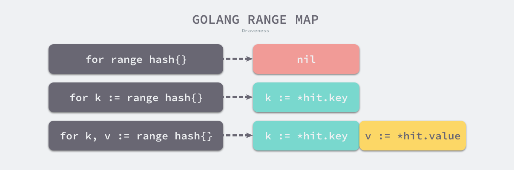
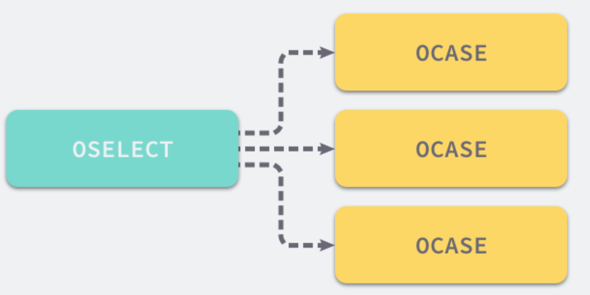
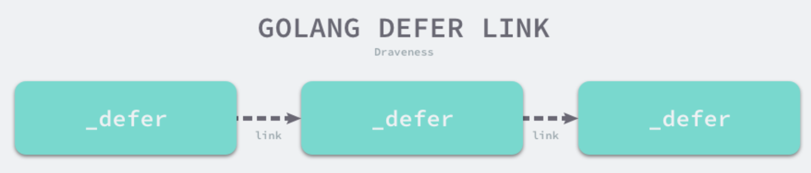

> 如需转载，请附上链接：[https://jwcen.github.io/](https://jwcen.github.io/)
{: .prompt-tip}

* This will become a table of contents (this text will be scrapped).
{:toc}

Go语言-常用关键字，new, make, defer, panic, recover, select, for-range

## make 和 new 的区别
都是给变量分配内存  
区别：
1. **作用变量类型不同**。
   - `new` 给值类型和用户定义的类型分配内存；
   - `make` 只能用于内置引用类型 slice、map、channel 分配内存
2. **初始化**。
   - `new` 会将分配的内存清零，并没有初始化内存；
   - `make` 分配空间后，会初始化内置的数据结构为零值
3. **返回类型不同**。
   - `new` 返回指向变量的指针；
   - `make` 返回引用类型本身

4. 分配内存的位置，堆还是栈上？
   - Go编译器尽量都将变量分配在栈上，如果变量未发生逃逸（所初始化的变量不需要在当前作用域外生存），就在栈上分配，否则分配在堆上
   - 如果变量占用内存超过了栈空间，或栈空间不足，就会分配在堆上。
   - make(slice, n)，切片大小不固定，也会在堆上分配

### 内存逃逸： 从“栈上”逃逸到“堆上”
- 程序中每个函数都有自己的**内存区域**存放自己的局部变量和返回地址等，这些内存由编译器在**栈**中分配，每个函数都会分配一个栈帧，在函数运行结束后进行销毁。
- 如果某个变量想要在函数结束后继续使用，需要把它在堆上分配。
### 逃逸分析
> 为更好地进行内存分配，提高程序运行效率  

- 程序在编译期间通过分析函数的变量，确定是在堆上分配还是栈上。在编译期间做是因为函数局部变量占用多少内存，需要在程序编译期间确定，运行时无法修改。
- 堆适合不可预知大小的内存分配。代价：分配速度慢、会形成内存碎片
  - 需要找到一块大小合适的内存块，之后需通过GC才能释放
- 栈。内存分配速度快，只需要2个cpu指令: `push`, `release`
- `go build -gcflags '-m -m -l' test.go`，比如包含 "xxx escapes to heap" 就说明发生了内存逃逸。 

#### 逃逸分析案例

~~~go
func add(x, y int) int {
   res := 0 
   res = x + y 
   return &res 
}
func main() {
   add(1, 2)
}
~~~



fmt.Printf 函数如残是一个 interface{} 类型，编译期间难以确定参数具体类型，也会发生逃逸。  
~~~go
func main() {
   str := "hello" 
   fmt.Printf("%v", str) 
}
~~~



- 函数为指针类型，作为返回值时发生了逃逸
- 匿名函数中使用外部变量n，n会存在到 in 被销毁，故n逃逸到堆上
~~~go
func increase() func() int {
   n := 0 
   return func() int {
      n++
      return n 
   }
}

func main() {
   in := increase() 
   fmt.Println(in()) // 1 
}
~~~



 4.当变量过大，完全超过了栈空间大小，也会发生逃逸 

## for 和 range
对于数组和切片：
```go 
for i := 0; i < len(arr); i++ {}  // 经典循环
for range arr {} // 遍历数组，不关系索引和数据
for i := range arr {} // ..., 不关心数据
for i, v := range arr {} // 关心索引和数据
```
注意点：  
- go语言会额外**创建一个新的 v2 变量**存储切片中的元素，循环中使用的这个变量 v2 会在**每一次迭代被重新赋值而覆盖**，赋值时也会**触发拷贝**， 且循环中**每次都使用的v2变量**
- 在循环中获取返回变量的地址都完全相同  

~~~go
// a为原始slice
ha := a
hv1 := 0
// slice长度
hn := len(a)
v1 := 0
v2 := nil // for i,v := range 中的 v
for ; h1 < hn ; h1++ {
    tmp := ha[hv1]
    v1,v2 := hv1,tmp
} 
~~~



对于哈希表map： 


- Go运行时通过 fastrand 生成一个随机数帮助我们随机选择一个遍历桶的起始位置。
- 


对于字符串： 
与遍历数组/切片相似，只是在遍历时会获取字符串中索引对应的字节并将字节转换成 `rune`
- 如果当前的 rune 是 ASCII 的，那么只会占用一个字节长度，每次循环体运行之后只需要将索引加一，但是如果当前 rune 占用了多个字节就会使用 runtime.decoderune 函数解码

遍历channel:

~~~go
ha := a
hv1, hb := <-ha
for ; hb != false; hv1, hb = <-ha {
    v1 := hv1
    hv1 = nil
    ...
}
~~~

- 如果不存在当前值，意味着当前的管道已经被关闭；
- 如果存在当前值，会为 v1 赋值并清除 hv1 变量中的数据，然后重新陷入阻塞等待新数据；


## select 
Go 语言中的 `select` 也能够让 Goroutine 同时等待多个 Channel 可读或者可写，在多个文件或者 Channel状态改变之前，`select` 会一直阻塞当前线程或者 Goroutine。
- 与 switch 不同的是，select 中虽然也有多个 case，但是这些 case 中的表达式**必须都是 Channel 的收发操作。**

应用场景：
- timeout 的超时机制
- 实现心跳机制：监听 channel 的同时，执行一些周期性的任务
  - time.NewTicker，创建 Ticker 类型实例。它包含一个 channel 类型的字段 C，会按一定时间间隔持续产生事件，就像“心跳”一样。

**数据结构：**
Golang实现select时，定义了一个数据结构scase，表示每个case语句.
非默认的 case 中都与 Channel 的发送和接收有关，所以结构体中也包含一个 runtime.hchan 类型的字段**存储 case 中使用的 Channel**。

select执行过程可以类比成一个函数，函数输入case数组，输出选中的case，然后程序流程转到选中的case块。

```go
type scase struct {
   c    *hchan         // 存储 case 中使用的 Channel
   elem unsafe.Pointer // data element
}
```

### 实现原理

select 语句在编译期间会被转换成 `OSELECT` 节点。每个 `OSELECT` 节点都会持有一组 `OCASE` 节点，如果 `OCASE` 的执行条件是空，那就意味着这是一个 default 节点。


在编译期间，Go 语言也会对 `select` 语句进行优化，它会根据 `select` 中 `case` 的不同选择不同的优化路径：
1. **空的 `select` 语句**会被转换成调用 `runtime.block` 直接挂起当前 Goroutine；
2. 如果 `select` 语句中**只包含一个 `case`**，编译器会将其转换成 `if ch == nil { block }; n; 表达式`；
   - 首先判断操作的 Channel 是不是空的；
   - 然后执行 `case` 结构中的内容；
3. 只包含两个 `case` 并且其中一个是 default，那么会使用 `runtime.selectnbrecv` 和 `runtime.selectnbsend` 非阻塞地执行收发操作；
4. 默认情况下会通过 `runtime.selectgo` 获取执行 `case` 的索引，并通过多个 `if` 语句执行对应 `case` 中的代码


进行优化之后，Go 语言会在运行时执行编译期间展开的 runtime.selectgo 函数，该函数会按照以下的流程执行：
1. 随机生成一个遍历的轮询顺序 `pollOrder` 并根据 Channel 地址生成锁定顺序 `lockOrder`
2. 根据 `pollOrder` 遍历所有的 `case` , 查看是否有可以立刻处理的 Channel
   - 如果存在，直接获取 `case` 对应的索引并返回；
   - 如果不存在，创建 `runtime.sudog` 结构体，**将当前 Goroutine 加入到所有相关 Channel 的收发队列**，并调用 `runtime.gopark` **挂起当前 Goroutine 等待调度器的唤醒**；
3. 当调度器唤醒当前 Goroutine 时，会再次按照 `lockOrder` 遍历所有的 `case`，从中查找需要被处理的 `runtime.sudog` 对应的索引


## defer 
Go 语言的 defer 会在**当前函数返回前执行传入的函数**，它会经常被用于关闭文件描述符、关闭数据库连接以及解锁资源。

### 现象

~~~go
func main() {
   startedAt := time.Now()
   defer fmt.Println(time.Since(startedAt))

   time.Sleep(time.Second)
}
~~~
现象：预期1, 输出0.  
原因：  
调用 `defer` 关键字会**立刻拷贝函数中引用的外部参数**，所以 `time.Since(startedAt)` 的结果不是在 `main` 函数退出之前计算的，而是**在 `defer` 关键字调用时计算的**.

解决：向 `defer` 关键字传入匿名函数  
```go 
defer func() { fmt.Println(time.Since(startedAt)) }()
```


结论：  
- 后调用的 defer 函数会先执行：
  - 后调用的 defer 函数会被追加到 Goroutine _defer 链表的最前面；
  - 运行 `runtime._defer` 时是从前到后依次执行；
- 函数的参数会被预先计算；
  - 调用 `runtime.deferproc` 函数创建新的延迟调用时就会立刻拷贝函数的参数，函数的参数不会等到真正执行时计算；

### 数据结构
`runtime._defer` 结构体是延迟调用链表上的一个元素，所有的结构体都会**通过 `link` 字段串联成链表**。

~~~go
type _defer struct {
   siz       int32 // 参数和结果的内存大小
   started   bool
   openDefer bool  //  表示当前 defer 是否经过开放编码的优化
   sp        uintptr  // 栈指针
   pc        uintptr  // 调用方的程序计数器
   fn        *funcval // 关键字中传入的函数
   _panic    *_panic // 触发延迟调用的结构体，可能为空
   link      *_defer
}
~~~




## panic 和 recover
- `panic` 能够改变程序的控制流，调用 `panic` 后会立刻停止执行当前函数的剩余代码，并在当前 Goroutine 中递归执行调用方的 `defer`
- `recover` 可以中止 `panic` 造成的程序崩溃。它是一个只能在 `defer` 中发挥作用的函数，在其他作用域中调用不会发挥作用

### 现象


`panic` 只会触发当前 Goroutine 的 `defer`
~~~go
func main() {
   defer println("in main")
      go func() {
         defer println("in goroutine")
         panic("")
      }()

   time.Sleep(1 * time.Second)
}

$ go run main.go
in goroutine
panic:
...
~~~



recover 只有在 defer 中调用才会生效
~~~go
func main() {
   defer fmt.Println("in main")
   // if err := recover(); err != nil {
   //       fmt.Println(err)
   // }
   // recover 只有在 defer 中调用才会生效
   defer func() {
      if err := recover(); err != nil {
         fmt.Println(err)
      }
   }()

   panic("unknown err")
}
~~~


3. panic 允许在 defer 中嵌套多次调用

----
参考
- [golang内存分配原理及make和new的区别](https://www.cnblogs.com/33debug/p/12068699.html)
- go101.org

> 如需转载，请附上链接：[https://jwcen.github.io/](https://jwcen.github.io/)
{: .prompt-tip}