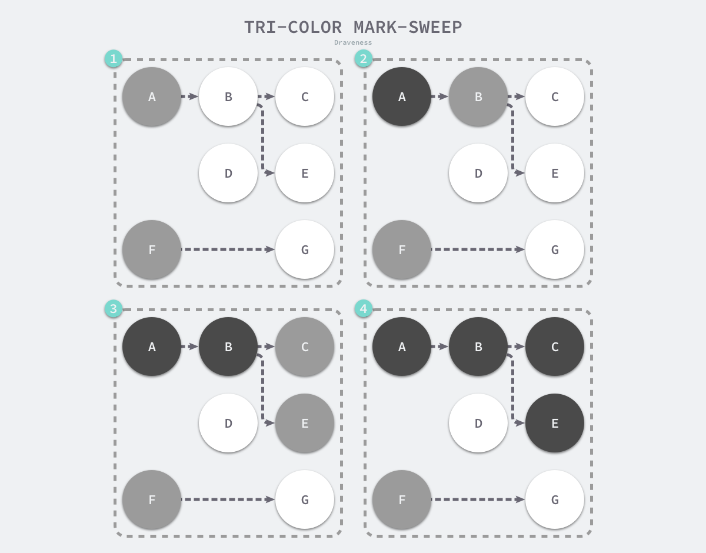
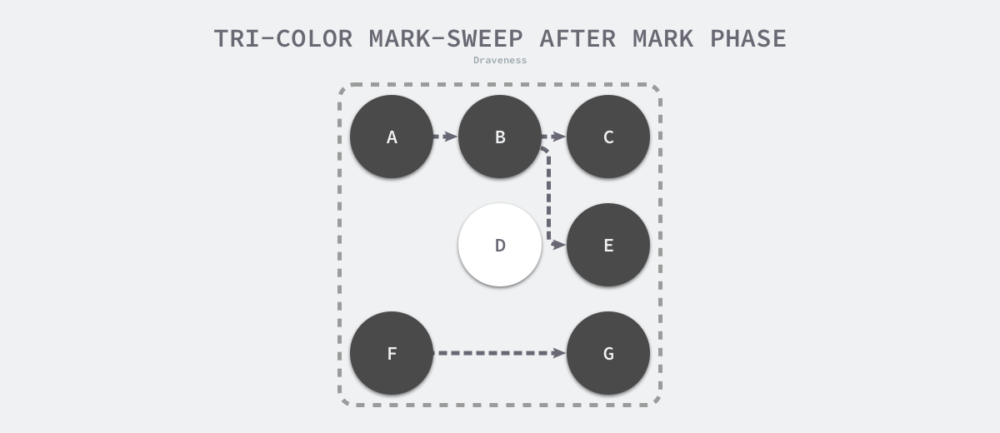
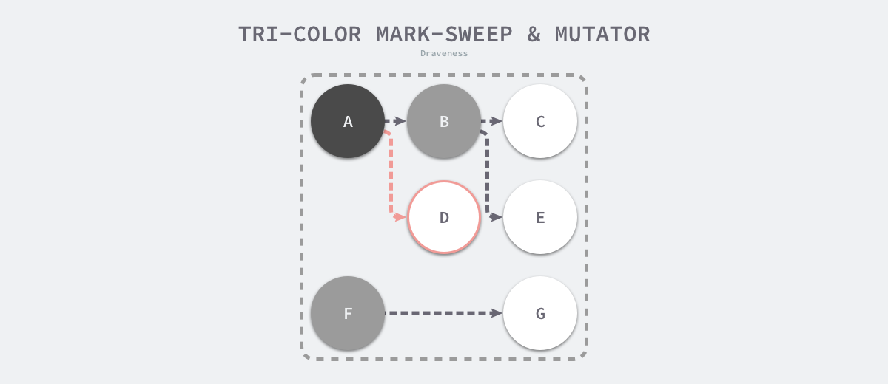
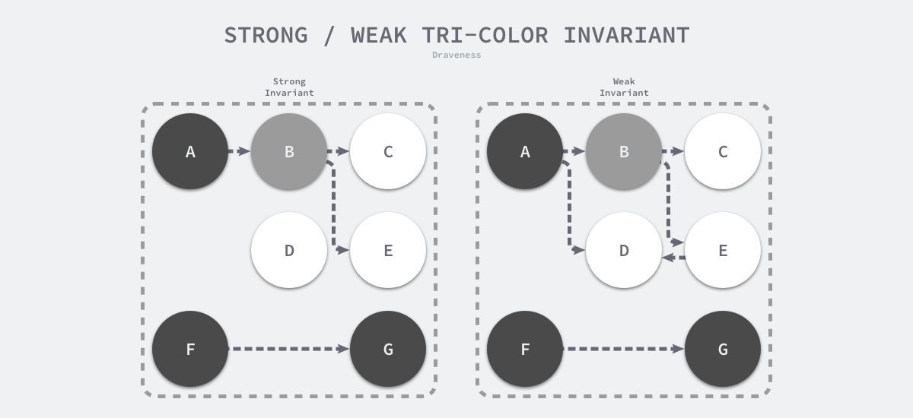

> 如需转载，请附上链接：[https://jwcen.github.io/](https://jwcen.github.io/)
{: .prompt-tip}

* This will become a table of contents (this text will be scrapped).
{:toc}

## 垃圾回收原理
Golang的垃圾回收（GC）也是内存管理的一部分。  
垃圾回收的核心就是**标记出哪些内存还在使用中(即被引用到)，哪些内存不再使用了（即未被引用），把未被引用的内存回收掉，以供后续内存分配时使用。**该过程是在 go 程序运行中以并发的方式去进行的，不是go程序执行之前或之后。

## 常见垃圾回收算法
- 引用计数： 对每个对象维护一个引用计数，当引用该对象的对象被销毁时，引用计数-1, 当引用计数器为 0 时就回收该对象。
  - 优点：对象很快的被回收，不会出现内存耗尽或到达某个阈值时才回收
  - 缺点：不能很好的处理循环应用，且实时维护引用计数，有一定的代价
  - 代表语言：Python、PHP
- 标记-清除：从根变量开始遍历所有的引用对象，引用的对象会被标记为“被引用”，未被标记的对象就被回收。
  - 优点：解决了引用计数的缺点
  - 缺点：需要 Stop the world（暂时停止程序运行）
  - Golang 
- 分代收集：按照对象的生命周期长短划分不同的代空间，生命周期长的放入老年代，短的放入新生代，不同代有不同的回收算法和回收频率。
  - 优点：回收性能好
  - 缺点：算法复杂
  - Java

## 三色标记清除
Go 使用的是标记清除算法，使实现三色标记算法缩短 STW 的时间。  
### 标记清除

### 三色抽象
该算法将程序的对象分为黑、灰、白色三类：
- 黑色对象：活跃的对象，从根对象可达的对象 和 不存在任何引用外部指针的对象
- 灰色对象：活跃的对象，存在指向白色对象的外部指针，故 GC 会扫描这些对象的子对象
- 白色对象：潜在的垃圾，其内存可能会被 GC 回收

### 三色标记 GC 的执行过程
{: width="600" height="400"}_三色标记垃圾收集器的执行过程_  
工作原理：
GC 开始工作时，程序中不存在任何黑色对象，根对象会被标记为灰色，然后：
1. 从灰色对象的集合中，选择一个灰色对象并标记成黑色
2. 把黑色对象指向的所有对象都标记为灰色，保证该对象和被其引用的对象都不会回收
3. 重复1, 2 直到不存在灰色对象
当灰色集合中不存在任何对象时，标记阶段就结束了。应用程序的堆中只能看到黑色的存活对象和白色的垃圾对象，GC 回收白色的垃圾。  

{: width="600" height="400"}_三色标记后的堆_

#### 三色标记清除的缺陷：  
不能和程序一起并发工作，仍需要 STW，用户程序可能在标记执行过程中修改对象指针，导致本来不应该被回收的对象却被回收了。  
{: width="600" height="400"}_因为程序中已经不存在灰色对象了, D 对象会被垃圾收集器错误地回收_ 

## 屏障技术
一种屏障指令，保证内存操作的顺序性。  
在并发的标记算法保证正确性，需达成两种三色不变性：
- 强三色不变性：黑色对象不会指向白色对象，只会指向灰或黑对象
- 弱三色不变性：黑指向的白对象必须包含一条从灰对象经过多个白对象的可达路径

{: width="600" height="400"}_强/弱三色不变性_  

> 遵循任意一个不变性都能保证垃圾回收算法的正确性；    
> 屏障技术就是在并发或者增量标记过程中保证三色不变性的重要技术。
{: .prompt-info}

### 写屏障
 Go 语言中使用的两种写屏障技术，分别是 Dijkstra 提出的插入写屏障8和 Yuasa 提出的删除写屏障。  

### 混合写屏障

> 如需转载，请附上链接：[https://jwcen.github.io/](https://jwcen.github.io/)
{: .prompt-tip}
----
参考
- Go 语言设计与实现
- Go 专家编程