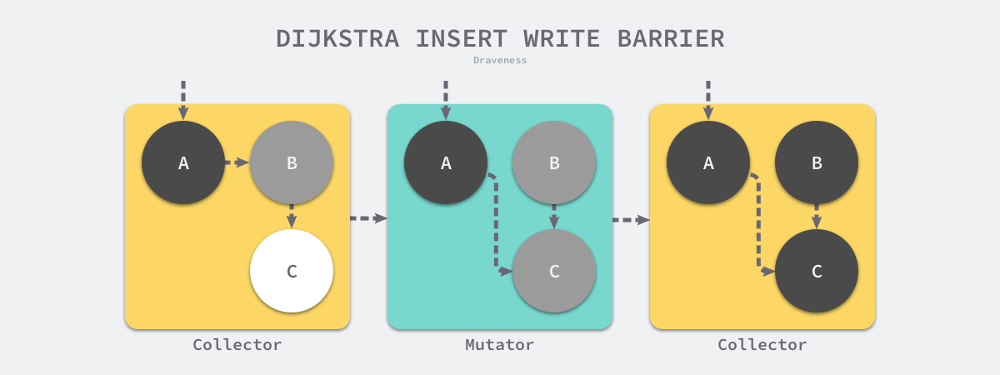
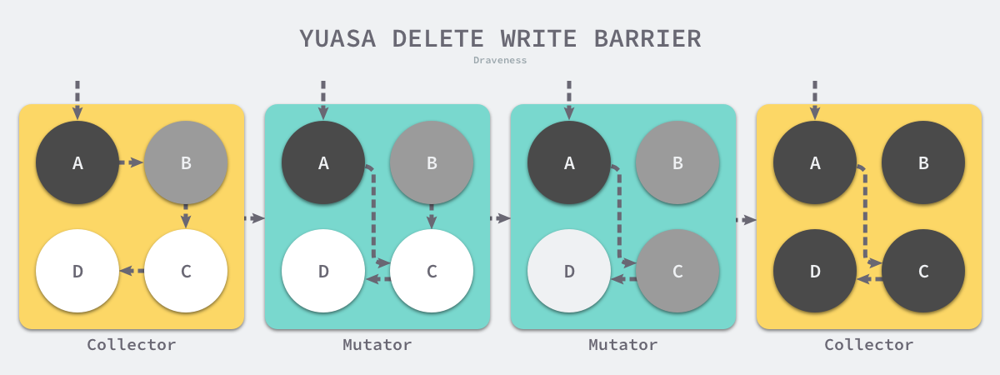
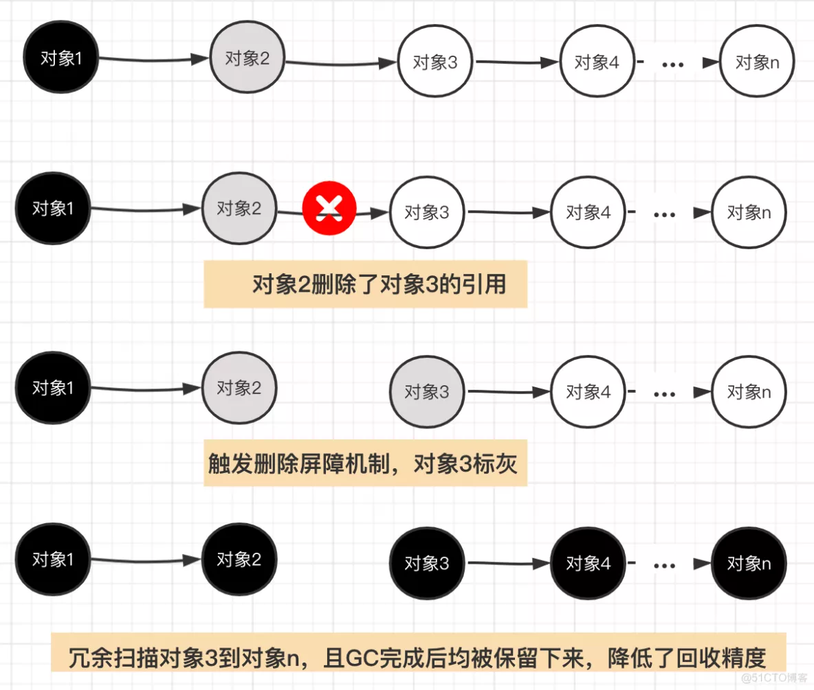

> 如需转载，请附上链接：[https://jwcen.github.io/](https://jwcen.github.io/)
{: .prompt-tip}

* This will become a table of contents (this text will be scrapped).
{:toc}

## 垃圾回收原理
垃圾回收（GC）是一种自动内存管理机制。  
垃圾回收的核心就是**标记出哪些内存还在使用中(即被引用到)，哪些内存不再使用了（即未被引用），把未被引用的内存回收掉，以供后续内存分配时使用。**该过程是在 go 程序运行中以并发的方式去进行的，不是go程序执行之前或之后。

### GC 相关术语
- 赋值器：程序执行过程中，可能会改变对象的引用关系或创建新的引用
- 回收器：负责回收不再被引用的对象
- STW： stop the world，GC期间某个阶段会停止所有的赋值器，中断你的程序逻辑，以确定引用关系。
- 根对象: 指赋值器不需要通过其他对象就可以直接访问到的对象，通过Root对象, 可以追踪到其他存活的对象。
- 常见的root对象有：
  - **全局变量**：程序在编译期就能确定的那些存在于程序整个生命周期的变量。
  - **执行栈**：每个 goroutine (包括main函数)都拥有自己的执行栈，这些执行栈上包含栈上的变量及堆内存指针。【堆内存指针即在gorouine中申请或者引用了在堆内存的变量】

## 常见垃圾回收算法
- 引用计数： 对每个对象维护一个引用计数，当引用该对象的对象被销毁时，引用计数-1, 当引用计数器为 0 时就回收该对象。
  - 优点：对象很快的被回收，不会出现内存耗尽或到达某个阈值时才回收
  - 缺点：不能很好的处理循环应用，且实时维护引用计数，有一定的代价
  - 代表语言：Python、PHP
- 标记-清除：从根变量开始遍历所有的引用对象，引用的对象会被标记为“被引用”，未被标记的对象就被回收。
  - 优点：解决了引用计数的缺点
  - 缺点：需要 Stop the world（暂时停止程序运行）
  - Golang 
- 分代收集：按照对象的生命周期长短划分不同的代空间，生命周期长的放入老年代，短的放入新生代，不同代有不同的回收算法和回收频率。
  - 优点：回收性能好
  - 缺点：算法复杂
  - Java

## 三色标记清除
Go 使用的是标记清除算法，使实现三色标记算法缩短 STW 的时间。  
### v1.3 标记清除
跟踪式垃圾收集器，执行过程分标记、清除两个阶段：
- 标记阶段：从根对象出发查找并标记堆中所有存活的对象
- 清除阶段：遍历堆中的全部对象，回收未被标记的垃圾对象并把回收的内存加入空闲链表

对于第一阶段根对象枚举来说，是必须暂停用户程序的，也即 STW，不然如果分析过程中用户程序还在运行，就可能会**导致根节点集合的对象引用关系不断变化**，这样可达性分析结果的准确性显然也就无法保证了。  

第二阶段 ”遍历堆中的全部对象“，如果不进行 STW 的话，会导致一些问题，由于第二阶段时间比较长，长时间的 STW 很影响性能。

需要用到更复杂的机制--[三色标记法]--来解决 STW 的问题。

### v1.5 辅助分析的工具: 三色标记法
该算法将程序的对象分为黑、灰、白色三类：
- 黑色对象：活跃的对象，从根对象可达的对象 和 不存在任何引用外部指针的对象
- 灰色对象：活跃的对象，存在指向白色对象的外部指针，故 GC 会扫描这些对象的子对象
- 白色对象：潜在的垃圾，其内存可能会被 GC 回收

### 三色标记 GC 的执行过程
{: width="600" height="400"}_三色标记垃圾收集器的执行过程_  
工作原理：
GC 开始工作时，程序中不存在任何黑色对象，根对象会被标记为灰色，然后：
1. 从灰色对象的集合中，选择一个灰色对象并标记成黑色
2. 把黑色对象指向的所有对象都标记为灰色，保证该对象和被其引用的对象都不会回收
3. 重复1, 2 直到不存在灰色对象
当灰色集合中不存在任何对象时，标记阶段就结束了。应用程序的堆中只能看到黑色的存活对象和白色的垃圾对象，GC 回收白色的垃圾。  

{: width="600" height="400"}_三色标记后的堆_

### 三色标记清除的缺陷： 悬挂指针
不能和程序一起并发工作，仍需要 STW，因为用户程序可能在标记执行过程中修改对象指针，导致本来不应该被回收的对象却被回收了。  
> 
{: width="600" height="400"}_因为程序中已经不存在灰色对象了, D 对象会被垃圾收集器错误地回收_  

这种错误称为**悬挂指针**，即指针没有指向特定类型的合法对象，影响了内存的安全性，想要并发或者增量地标记对象还是需要使用[屏障技术]。  

结论：在三色标记法的过程中对象丢失，需要同时满足下面两个条件：
- 条件一：白色对象被黑色对象引用
- 条件二：灰色对象与白色对象之间的可达关系遭到破坏  

看来只要把上面两个条件破坏掉一个，就可以保证对象不丢失。

#### 两种破坏条件的方式
- **强三色不变性**：不允许黑色对象引用白色对象---破坏了条件1，避免被当作垃圾回收
- **弱三色不变性**：黑色对象可以指向白对象，但必须包含一条从灰对象经过多个白对象的可达路径---破坏了条件2，从而白色对象一定可以扫描到

{: width="600" height="400"}_强/弱三色不变性_  

> 遵循任意一个不变性都能保证垃圾回收算法的正确性；    
> [屏障技术]就是在并发或者增量标记过程中保证三色不变性的重要技术。
{: .prompt-info}

## 屏障技术
Golang团队遵循上述两种不变式提到的原则，分别提出了两种实现机制：[插入写屏障]和[删除写屏障]。

### 插入写屏障
规则：当一个对象引用另外一个对象时，将另外一个对象标记为灰色。  
满足：强三色不变式。不会存在黑色对象引用白色对象

> 插入屏障**仅会在堆内存中生效**，不对栈内存空间生效，这是因为 go 在并发运行时，大部分的操作都发生在栈上，函数调用会非常频繁。数十万 goroutine 的栈都进行屏障保护自然会有性能问题。  
> 所以，Go团队实现上选择在标记阶段完成时进行 STW，将所有栈对象标记为灰色并重新扫描。
{: .prompt-tip}

插入写屏障，在一个垃圾收集器和用户程序交替运行的场景的标记过程：  
- 垃圾收集器将根对象指向 A 对象标记成黑色并将 A 对象指向的对象 B 标记成灰色；
- 用户程序修改 A 对象的指针，将原本指向 B 对象的指针指向 C 对象，这时**触发写屏障将 C 对象标记成灰色**；
- 垃圾收集器依次遍历程序中的其他灰色对象，将它们分别标记成黑色；
_插入写屏障_  

对象 C 在插入写屏障机制下，得到了保护，但是由于栈上的对像没有插入写机制，在扫描完成后，仍然可能存在栈上的白色对象被黑色对象引用，所以在**最后需要对栈上的空间进行 STW，重新扫面一遍，防止对象误删除**【弊端】。

### 删除写屏障
在 GC 开始时，会扫描记录整个栈做快照，从而在删除操作时，可以拦截操作，将白色对象置为灰色对象。  

规则：在老对象的引用被删除时，将白色的老对象涂成灰色，这样删除写屏障就可以保证弱三色不变性，老对象引用的下游对象一定可以被灰色对象引用。  
_删除写屏障_  
- 垃圾收集器将根对象指向 A 对象标记成黑色并将 A 对象指向的对象 B 标记成灰色；
- 用户程序将 A 对象原本指向 B 的指针指向 C，**触发删除写屏障**，但是因为 B 对象已经是灰色的，所以不做改变；
- 用户程序将 B 对象原本指向 C 的指针删除，**触发删除写屏障，白色的 C 对象被涂成灰色；**
- 垃圾收集器依次遍历程序中的其他灰色对象，将它们分别标记成黑色；  

引入删除写屏障，有一个弊端:一个对象的引用被删除后，即使没有其他存活的对象引用它，它仍然会活到下一轮。如此一来，会产生很多的冗余扫描成本，且降低了回收精度：
_删除写屏障弊端_

### v1.8 混合写屏障
Go团队结合了这两种写屏障的优点，在v1.8版本下引入了混合写屏障机制。  
**核心定义：**
- GC 刚开始的时候，会将**栈上**的可达对象全部标记为黑色。
- GC 期间，任何在**栈上**新创建的对象，均为黑色。

  这两点的目的是将栈上的可达对象全部标黑，**最后无需对栈进行 STW**，就可以**保证栈上的对象不会丢失**。  
  还有：
- **堆上**被删除/新添加的对象标记为灰色

> 栈上的对象引用了堆上的对象，不会触发混合写屏障机制
{: .prompt-tip}

## 垃圾回收触发时机
运行时会通过`runtime.gcTrigger.test`方法决定是否需要触发垃圾收集，当满足触发的基本条件时 —- **允许垃圾收集、程序没有崩溃且没有处于垃圾收集循环** -- 该方法会根据 3 种不同方式触发进行不同的检查：
   - `gcTriggerHeap`：当所分配的堆内存大小达到阈值（由控制器计算的触发堆的大小）时，将会触发。
   - `gcTriggerTime`：当距离上一个 GC 周期的时间超过一定时间时，将会触发。时间周期以`runtime.forcegcperiod` 变量为准，默认 2 分钟。
   - `gcTriggerCycle`：如果没有开启 GC，则启动 GC。

### 后台触发
运行时会在应用程序启动时**在后台开启一个用于强制触发垃圾收集的 Goroutine**，该 Goroutine 的职责非常简单 — 调用 runtime.gcStart 尝试启动新一轮的垃圾收集。

> 该 Goroutine 会在循环中调用 runtime.goparkunlock 主动陷入休眠等待其他 Goroutine 的唤醒，以减少对计算资源的占用。

下面两个方法会从任意处理器上触发垃圾收集，这种不需要中心组件协调。
### 手动触发
用户程序会通过 `runtime.GC` 函数在程序运行期间主动通知运行时执行，该方法在调用时**会阻塞调用方直到当前垃圾收集循环完成**，在垃圾收集期间也可能会通过** STW 暂停整个程序**。

### 申请内存
`runtime.mallocgc`. 运行时会将堆上的对象按大小分成微对象、小对象和大对象三类，这三类对象的创建都可能会触发新的垃圾收集循环。

> 如需转载，请附上链接：[https://jwcen.github.io/](https://jwcen.github.io/)
{: .prompt-tip}
----
参考
- Go 语言设计与实现
- Go 专家编程
- https://blog.51cto.com/u_15730090/5510574