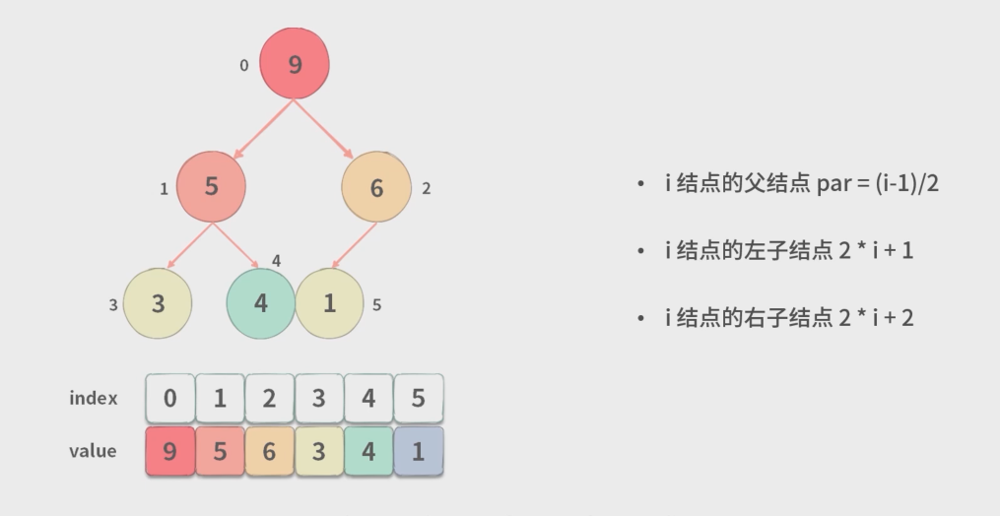
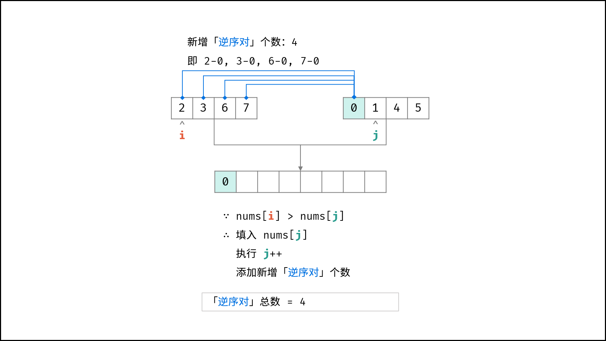

> 如需转载，请附上链接：[https://jwcen.github.io/](https://jwcen.github.io/)
{: .prompt-tip}

* This will become a table of contents (this text will be scrapped).
{:toc}

## 冒泡排序
思想：
- 比较相邻的元素。如果第一个比第二个大，就交换他们两个。
- 对每一对相邻元素作同样的工作，从开始第一对到结尾的最后一对。这步做完后，最后的元素会是最大的数。
- 持续每次对越来越少的元素重复上面的步骤，直到没有任何一对数字需要比较。


~~~go
func sortArray(nums []int) []int {
    n := len(nums) 
    for i := 0; i < n-1; i++ {
        for j := 0; j < n-i-1; j++ {
            if nums[j] > nums[j+1] {
                swap(nums, j, j+1)
            }
        }
    }
    return nums 
}

func swap(nums []int, i, j int) {
    nums[i], nums[j] = nums[j], nums[i] 
}
~~~


> 稳定。n 小时较好。

## 插入排序
思想： 
- 将一待排序序列的第一个元素看做一个有序序列，把第二个元素到最后一个元素当成是未排序序列。
`nums[0]`有序，`nums[1...n]`未排序
- 从头到尾依次扫描未排序序列，将扫描到的每个元素插入有序序列的适当位置。（如果待插入的元素与有序序列中的某个元素相等，则将待插入元素插入到相等元素的后面。）

~~~go
func sortArray(nums []int) []int {
    n := len(nums) 
    for i := 1; i < n; i++ {
        cur := nums[i] 
        j := i 
        for j > 0 && nums[j-1] > cur { // 当前的比前一个小
            nums[j] = nums[j-1] 
            j--
        }
        nums[j] = cur 
    }
    return nums
}
~~~


> 稳定。n小时 或 用在大部分元素已经有序的场景较好。

## 选择排序
思想：
- 首先在**未排序序列**中找到最小（大）元素，存放到**排序序列**的起始位置。
- 再从**剩余未排序元素**中继续寻找最小（大）元素，然后放到**已排序序列**的末尾。
- 重复第二步，直到所有元素均排序完毕。

~~~go
func sortArray(nums []int) []int {
    n := len(nums) 
    for i := 0; i < n-1; i++ {
        minIdx := i 
        for j := i+1; j < n; j++ {
            if nums[j] < nums[minIdx] {
                minIdx = j 
            }
        }
        swap(nums, i, minIdx)
    }
    return nums
}
~~~


> 不稳定，n 小时较好。

## 快速排序
### 普通快排：

~~~go
func sortArray(nums []int) []int {
    quickSort(nums)
    return nums
}

func quickSort(nums []int) {
    n := len(nums) 
    if n <= 1 {
        return
    }

    // 优化1： 小区间插入排序
    if n < 20 { 
        insertSort(nums)
        return
    }

    left, right := 0, n-1
    // pivot := nums[0]
    // 随机 pivot 值
    rand.Seed(time.Now().UnixNano()) 
    r := left + rand.Intn(right - left + 1) 
    swap(nums, left, r)
    pivot := nums[left]
    i := left + 1 
    
    for left < right {
        // 大于基准点的放到右边
        if nums[i] > pivot {
            swap(nums, i, right) 
            right--
        } else { // 小于的放左边
            swap(nums, i, left) 
            left++
            i++
        }
    }

    // 再分别对两个小区域进行快排
    nums[left] = pivot
    quickSort(nums[:left])
    quickSort(nums[left+1:])
}

func insertSort(nums []int) {
    n := len(nums)
    for i := 1; i < n; i++ {
        cur := nums[i] 
        j := i 
        for j > 0 && cur < nums[j-1] {
            nums[j] = nums[j-1] 
            j--
        }
        nums[j] = cur
    } 
}
~~~


- 优化1：小区间使用插入排序
 在待排序区间长度比较短的时候可以使用插入排序来提升排序效率 。
- 优化2：随机选择标定点元素，降低递归树结构不平衡情况
  - 快速排序在近乎有序的时候会非常差(基准元素被交换到越中间，递归执行的深度就越浅，执行效率才越高)，此时递归树的深度会增加。退化为 O(N^2) 
  - 解决：在每一次迭代开始之前，随机选取一个元素作为基准元素与第 1 个元素交换即可。  

> 不稳定，n小时较好。

### 双路快排：  
双路快排是一种可以处理存在大量相同元素的快速排序算法，它的思路是**将数组分成小于等于 pivot 和大于等于 pivot 两个区间**，从而避免了递归深度过大的问题。
> 可能会导致分割不均匀的情况。  


~~~go
func sortArray(nums []int) []int {
    quickSort(nums, 0, len(nums)-1)
    return nums
}

func insertSort(nums []int, left, right int) {
    for i := left + 1; i <= right; i++ {
        t := nums[i]
        j := i
        for j > left && t < nums[j-1] {
            nums[j] = nums[j-1]
            j--
        }
        nums[j] = t
    }
}

func quickSort(nums []int, left, right int) {
    if left >= right {
        return
    }

    // 优化1：元素少用插入排序
    if right - left + 1 < 20 {
        insertSort(nums, left, right)
        return
    }

    pivotIdx := partition(nums, left, right)

    quickSort(nums, left, pivotIdx-1)
    quickSort(nums, pivotIdx+1, right)
}

func partition(nums []int, left, right int) int {
    // 优化2：随机选取 pivot 值
    rand.Seed(time.Now().UnixNano())
    rid := left + rand.Intn(right - left + 1)
    nums[left], nums[rid] = nums[rid], nums[left]
    pivot := nums[left]
    
    // 优化3：双路快排
    // 随机将与标定点相等的元素分配到左边和右边
    // 针对有许多重复键值的数组进行排序
    i := left+1
    j := right

    for {
        for i <= j && nums[i] < pivot {
            i++
        }
        for i <= j && nums[j] > pivot {
            j--
        }

        // i来到第一个大于等于pivot的位置
        // j来到第一个小于等于pivot的位置
        if i >= j {
            break
        }

        // 否则，就交换元素(在第一区间和第二个区间都找到了各自的元素)
        swap(nums, i, j)
        i++
        j--
    }

    swap(nums, left, j)
    return j
}
~~~


### 三路快排：  
三路快排将数组分成小于、等于、大于 pivot 的三个区间，使得相同的元素能够被均匀地分布在两侧，从而避免了递归深度过大的问题。  
> 三路快排的效率更高，因为双路快排可能会导致分割不均匀的情况。


~~~go
func sortArray(nums []int) []int {
    quickSort(nums, 0, len(nums)-1) 
    return nums 
}

func quickSort(nums []int, left, right int) {
    if left >= right {
        return 
    }

    if right - left + 1 < 20 {
        insertSort(nums, left, right)
        return
    }

    lt, gt := partition(nums, left, right) 
    quickSort(nums, left, lt-1) 
    quickSort(nums, gt+1, right) 
}

func partition(nums []int, left, right int) (int, int) {
    rand.Seed(time.Now().UnixNano()) 
    rid := left + rand.Intn(right-left+1) 
    swap(nums, left, rid) 

    pivot := nums[left]
    lt, gt := left, right
    i := left + 1 

    for i <= gt {
        if nums[i] < pivot { // 小于基准值放在左边
            swap(nums, i, lt) 
            lt++
            i++ 
        } else if nums[i] > pivot { // 大于基准值放在右边
            swap(nums, i, gt) 
            gt--
        } else { // 等于就当前位置前进
            i++
        }
    }
    return lt, gt 
}

func insertSort(nums []int, left, right int) {
    for i := left + 1; i <= right; i++ {
        cur := nums[i] 
        j := i 
        for j > left && cur < nums[j-1] {
            nums[j] = nums[j-1]
            j--
        }
        nums[j] = cur
    }
}

func swap(nums []int, i, j int) {
    nums[i], nums[j] = nums[j], nums[i]
}

// 循环中根据 nums[i] 与 pivot 的大小关系将它放到左边、右边或当前位置，最终当 i > gt 时循环结束。
// 此时，左边的数都小于 pivot，右边的数都大于 pivot，
// 等于 pivot 的数在中间，即 [lt, gt] 区间。

// 因此，最后的 lt 和 gt 就是基准值的最终位置所在的索引，最终数组中 
// [left, lt-1] 区间的数都小于 pivot，
// [gt+1, right] 区间的数都大于 pivot，[lt, gt] 
// 区间的数都等于 pivot。
~~~


### 时间复杂度分析
结论：平均情况下快速排序的时间复杂度都是$Θ(nlogn)$，最坏情况是$Θ(n^2)$.  
1. 普通快速排序
快速排序的时间复杂度主要**取决于递归的深度和每次 partition 操作的时间复杂度**。  
   - 最坏情况下，每次选取的基准值都是当前区间中的最大值或最小值，导致每次 partition 只能将区间缩小 1，此时**递归的深度为 n**，时间复杂度为 $O(n^2)$；  
   - 最好情况下，每次选取的基准值都能将区间平分成两个部分，递归深度为 $logn$，时间复杂度为 $O(nlogn)$。  
  
2. 双路快速排序  
双路快排在 partition 操作中，将数组分为小于基准值和大于基准值两部分，相对于普通快速排序来说，减少了某些情况下退化成链表的概率，使得时间复杂度更稳定。
   - 最坏情况下，每次选取的基准值都是当前区间的最大值或最小值，递归深度为 n，时间复杂度为 $O(n^2)$；
   - 最好情况下，每次都能将区间平分成两个部分，递归深度为 $logn$，时间复杂度为 $O(nlogn)$

3. 三路快速排序  
三路快速排序在 partition 操作中，将数组分为小于、等于和大于基准值的三个部分，相比于双路快排，它更适用于存在大量重复元素的数组。
   - 最坏情况下，每次选取的基准值都是当前区间的最大值或最小值，递归深度为 n，时间复杂度为 $O(n^2)$；
   - 最好情况下，每次都能将区间平分成三个部分，递归深度为 $logn$，时间复杂度为 $O(nlogn)$。

## 快速选择
思想： 快速选择(quickselect)是一种在最坏情况下时间复杂度为 $O(n)$ 的选择排序算法。它的基本思想是利用快排的分治思想，在每次分治的过程中找到数组的第k小元素。  

快速选择算法只需要使用两个指针，来维护分治的左右边界，因此只需要常数级别的空间。  
- 首先会选取一个随机的`pivot`。然后它会把数组分成两个子数组: lower和upper。lower数组包含小于等于枢轴的元素，而upper数组则包含大于枢轴的元素。
- 函数会递归地调用自身，并根据k值的大小选择递归调用lower或upper数组。
  - 如果k的值小于等于lower数组的长度，则递归调用lower数组。
  - 如果k的值正好等于lower数组的长度加1，则说明`pivot`就是数组的第k小元素，因此直接返回`pivot`即可。
  - 如果k的值大于lower数组的长度加1，则递归调用upper数组，并减去lower数组的长度加1。


~~~go
// quickselect finds the kth smallest element in an array.
func quickselect(arr []int, k int) int {
	// Choose a pivot randomly.
	rand.Seed(time.Now().UnixNano())
	pivotIdx := rand.Intn(len(arr))
	pivot := arr[pivotIdx]

	// Divide the array into two subarrays: lower and upper.
	lower := make([]int, 0, len(arr))
	upper := make([]int, 0, len(arr))
	for i, x := range arr {
		if i == pivotIdx {
			continue
		}
		if x <= pivot {
			lower = append(lower, x)
		} else {
			upper = append(upper, x)
		}
	}

	// Recurse on the appropriate subarray.
	if k <= len(lower) {
		return quickselect(lower, k)
	} else if k == len(lower)+1 {
		return pivot
	} else {
		return quickselect(upper, k-len(lower)-1)
	}
}

func main() {
	arr := []int{20, 21, 10, 50, 30, 6}
	fmt.Println(quickselect(arr, 4)) // Output: 21
}
~~~
  


~~~go
func findKthLargest(nums []int, k int) int {
    n := len(nums) 
    left, right := 0, n-1

    for {
        pos := partition(nums, left, right) 
        if pos == k-1 { 
            return nums[pos] 
        } else if pos < k-1 {
            left = pos + 1 
        } else {
            right = pos - 1
        }
    }

    return -1
}

func partition(nums []int, left, right int) int {
    pivot := nums[left] 
    i, j := left, right 
    for i < j {
        for i < j && nums[i] >= pivot {
            i++
        }
        nums[j] = nums[i] 
        for i < j && nums[j] <= pivot {
            j--
        }
        nums[i] = nums[j] 
    }
    nums[i] = pivot 
    return i 
}
~~~


## 归并排序
也是分治，快排时用一个random数来分，归并是用中间值来分。
- 分：不断将数组从中点位置分开，将整个数组排序问题转化为子数组排序问题
- 治：划分到子数组长度为1时，开始向上合并，**不断将较短排序数组合并为较长排序数组**，直至合并至原数组时完成排序


~~~go
const NUM = 10
func sortArray(nums []int) []int {
    // 临时数组, 可避免创建临时数组和销毁的消耗，避免计算下标偏移量。
    temp := make([]int, len(nums))
    mergeSort(nums, temp, 0, len(nums)-1)
    return nums
}

func insertSort(nums []int, left, right int) {
    for i := left + 1; i <= right; i++ {
        temp := nums[i]
        j := i
        for j > left && temp < nums[j-1] {
            nums[j] = nums[j-1]
            j--
        }
        nums[j] = temp
	}
}

func mergeSort(nums, temp []int, left, right int) {
    if left >= right {
        return
    }

    if right - left + 1 < NUM {
        insertSort(nums, left, right)
        return
    }

    mid := (left + right) / 2

    mergeSort(nums, temp, left, mid)
    mergeSort(nums, temp, mid+1, right)

    if nums[mid] <= nums[mid+1] {
    	return
	}

    merge(nums, temp, left, mid, right)
}

func merge(nums, temp []int, left, mid, right int) {
    copy(temp, nums)

    i := left
    j := mid+1
    for k := left; k <= right; k++ {
        if i > mid {
            nums[k] = temp[j]
            j++
        } else if j > right || temp[i] <= temp[j] {
            nums[k] = temp[i]
            i++
        } else {
            nums[k] = temp[j]
            j++
     	}
    }
}
~~~


> 稳定，n大时较好

## 堆排序
思想是：将待排序序列构造成一个大顶堆，此时，整个序列的最大值就是堆顶的根节点。将其与末尾元素进行交换，此时末尾就为最大值。然后将剩余n-1个元素重新构造成一个堆，这样会得到n个元素的次小值。如此反复执行，便能得到一个有序序列了。步骤：
1. 创建一个堆 `Heap[0……n-1]`；从**最后一个非叶子结点开始**，从左至右，从下至上进行调整。
2. 步骤二 将**堆顶元素与末尾元素进行交换，使末尾元素最大**。然后继续调整堆，再将堆顶元素与末尾元素交换，得到第二大元素。
3. 如此反复进行交换、重建、交换。
> 一般升序采用大顶堆，降序采用小顶堆  
> 空间复杂度 $O(1)$, 因为这个是原地操作的算法  
> 时间复杂度 $O(NlogN)$, 堆排序的自调节复杂度为 $O(logN)$  


~~~go
func sortArray(nums []int) []int {
    n := len(nums) 
    // 1. 构建大顶堆：从小到大排序
    buildHeap(nums, n) 

    // 2. 交换堆顶元素和末尾元素 + 调整堆结构 
    for i := n-1; i >= 0; i-- {
        swap(nums, 0, i)
        adjust(nums, 0, i) 
    }

    return nums 
}

func buildHeap(nums []int, n int) {
    //从第一个非叶子结点从下至上，从右至左调整结构
    for i := n/2-1; i >= 0; i-- {
        adjust(nums, i, n)
    }
}

func adjust(nums []int, i, n int) {
    for {
        largest := i 
        left, right := 2*i+1, 2*i+2 

        if left < n && nums[largest] < nums[left] {
            largest = left 
        }
        
        if right < n && nums[largest] < nums[right] {
            largest = right
        }

        if largest == i {
            break 
        }

        swap(nums, i, largest) 
        i = largest 
    }   
}
~~~


> 不稳定，n大时较好

## 稳定性
排序前后两个相等的数相对位置不变，则算法稳定。  
好处：
从一个键上排序，然后再从另一个键上排序，第一个键排序的结果可以为第二个键排序所用。

- 不稳定的算法
  - 堆排序：是选择排序的一种；
  - 快速排序：不稳定发生在中枢元素和a[j]交换的时刻；
  - 选择排序：如序列5 8 5 2 9， 第一遍选择第1个元素5会和2交换，那么原序列中2个5的相对前后顺序就被破坏了。
  - 希尔排序

- 稳定的算法
  - 冒泡排序：比较是相邻的两个元素比较，交换也发生在这两个元素之间
  - 归并排序：合并过程中可以保证当两个当前元素相等时，把处在前面序列的元素保存在结果序列的前面
  - 插入排序：在已经有序的小序列的基础上，一次插入一个元素
  - 基数排序

## 题目
### 剑指 Offer 51. 数组中的逆序对
在数组中的两个数字，如果前面一个数字大于后面的数字，则这两个数字组成一个逆序对。输入一个数组，求出这个数组中的逆序对的总数。  
输入: [7,5,6,4] 输出: 5  

方法1：归并排序，时间复杂度 $O(Nlog⁡N)$，思路：  
- 在合并两个排序数组的过程，每当遇到 `左子数组当前元素 > 右子数组当前元素`，**即「左子数组当前元素 至 末尾元素」 与 「右子数组当前元素」 构成了若干 「逆序对**   
- 如左子当前元素 2 到 末尾元素 7   和  右子当前元素0构成了4对逆序对  


~~~go
func reversePairs(nums []int) int {
    n := len(nums) 
    tmp := make([]int, n) 
    return mergeSort(nums, tmp, 0, n-1) 
}

func mergeSort(nums, tmp []int, left, right int) int {
    if left >= right {
        return 0 
    }

    mid := left + (right-left) / 2
    pairs := mergeSort(nums, tmp, left, mid) + mergeSort(nums, tmp, mid+1, right)

    // merge 
    for k := left; k <= right; k++ {
        tmp[k] = nums[k] 
    }

    i, j := left, mid+1 
    for k := left; k <= right; k++ {
        if i > mid {
            nums[k] = tmp[j] 
            j++
        } else if j > right || tmp[i] <= tmp[j] {
            nums[k] = tmp[i] 
            i++
        } else {
            nums[k] = tmp[j] 
            j++

            pairs += mid+1 - i
        }
    }

    return pairs
}

~~~


方法2：二分插入负数


~~~go
// 按照 -7，-5，-6，-4 的顺序插入，
// bisect_left 返回的待插入位置分别是 0，1，1，3，
// 加起来就是逆序对总数 5。
// 如果不用负数，就要用 res += len(q) - i 了，并且要改用 i = bisect.bisect(q, v)。
func reversePairs(nums []int) int {
    var q []int  // 用来存储 nums 的负数
    var res int

    for _, v := range nums {
        i := bisectLeft(q, -v)  // 查找在 q 中插入 -v 的位置 i
        res += i  // 表示在 q 中已经有 i 个元素小于 -v，因此有 i 个元素可以与 -v 组成数对。
        q = append(q, 0)  // 将 0 添加到 q 的末尾，扩展 q 的长度。
        copy(q[i+1:], q[i:])  // 将 q[i:] 中的元素向后移动一位，以便在 i 的位置插入 -v
        q[i] = -v  // 将 -v 插入到 q 的 i 位置，维护 q 的有序性。
    }

    return res
}

func bisectLeft(nums []int, target int) int {
    left, right := 0, len(nums)-1

    for left <= right {
        mid := left + (right-left)/2
        if nums[mid] < target {
            left = mid + 1
        } else {
            right = mid - 1
        }
    }

    return left
}

~~~


### 面试题：无序数组的中位数
- 首先创建一个小顶堆，它的大小是`k=len/2+1`,len是数组的长度。
- 接着，我们先向**堆中插入k个数**，这个过程叫做建堆。
- 接着，明确我们的目标，我们目标是在小顶堆中存放数组中后k个大的数字。
- 那么在继续遍历数组，**如果遇到比堆顶大的数，就删除堆顶插入新的数**，否则抛弃。
- 最终我们可以**得到数组k个最大的数。且堆顶是最小的**。
- 那么当数组长度是**偶数**的时候，**堆顶+第二小的平均值**就是中位数。
- 当数组长度是**奇数**的时候，堆顶就是中位数。


~~~go
func findMedianNum(nums []int) int {
    n := len(nums)
    k := n/2 + 1

    var h IntHeap
    heap.Init(&h)

    for i := 0; i < k; i++ {
        heap.Push(&h, nums[i])
    }

    for i := k; i < n; i++ {
        if h.Peek().(int) < nums[i] {
            heap.Pop(&h)
            heap.Push(&h, nums[i])
        }
    }

    if n%2 == 0 {
        temp := (h.Peek().(int) + heap.Pop(&h).(int)) / 2
        return temp
    }
    return h.Peek().(int)
}

type IntHeap []int

func (h IntHeap) Len() int            { return len(h) }
func (h IntHeap) Less(i, j int) bool  { return h[i] < h[j] }
func (h IntHeap) Swap(i, j int)       { h[i], h[j] = h[j], h[i] }
func (h IntHeap) Peek() interface{}   { return h[0] }
func (h *IntHeap) Push(x interface{}) { *h = append(*h, x.(int)) }
func (h *IntHeap) Pop() interface{} {
    old := *h
    n := len(old)
    x := old[n-1]
    *h = old[:n-1]
    return x
}
~~~
  
  

--- 
  

> 如需转载，请附上链接：[https://jwcen.github.io/](https://jwcen.github.io/)
{: .prompt-tip}