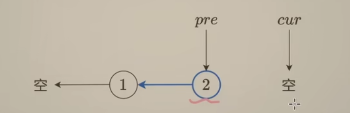
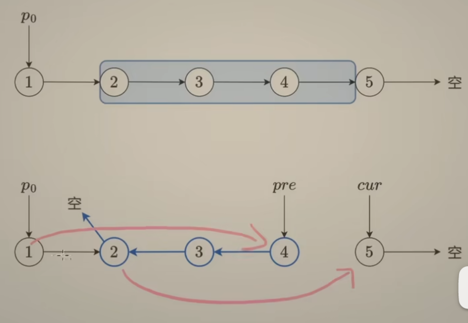
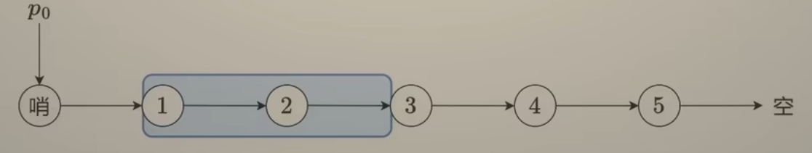
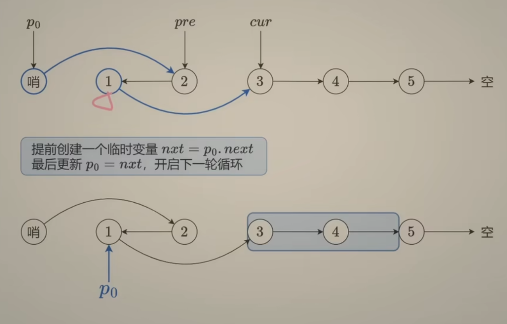

> 如需转载，请附上链接：[https://jwcen.github.io/](https://jwcen.github.io/)
{: .prompt-tip}

* This will become a table of contents (this text will be scrapped).
{:toc}

## 设计链表

~~~go
func InitList(n int) *LinkedNode {
    dummy := &LinkedNode{}
    pre := dummy
    for i := 1; i <= n; i++ {
        cur := &LinkedNode{Val: i}
        pre.Next = cur
        pre = pre.Next
    }
    return dummy.Next
}
~~~


### [707. 设计链表](https://leetcode.cn/problems/design-linked-list/description/)
设计链表的实现。您可以选择使用单链表或双链表。


~~~go
type Node struct {
	Val  int
	Next *Node
}

// NewNode 创建一个节点
func NewNode(val int) *Node {
	return &Node{Val: val, Next: nil}
}

type LinkedList struct {
	Header *Node // 虚拟头节点
	Len   int
}

// Constructor 创建一个链表
func Constructor() LinkedList {
	header := NewNode(0)
	return LinkedList{Header: header, Len: 0}
}

// Get：获取链表中第 index 个节点的值。如果索引无效，则返回-1
func (l *LinkedList) Get(index int) int {
	if index < 0 || index > l.Len-1 {
		return -1
	}

	cur := l.Header
	for i := 0; i <= index; i++ {
		cur = cur.Next
	}
	return cur.Val
}

// AddAtHead(val)：在链表的第一个元素之前添加一个值为 val 的节点。
// 插入后，新节点将成为链表的第一个节点。
func (l *LinkedList) AddAtHead(val int) {
	// 在Header节点后面直接添加一个节点
	node := NewNode(val)
	node.Next = l.Header.Next
	l.Header.Next = node

	l.Len++
}

// AddAtTail：将值为 val 的节点追加到链表的最后一个元素。
func (l *LinkedList) AddAtTail(val int) {
	node := NewNode(val)
	cur := l.Header
	for cur.Next != nil {
		cur = cur.Next
	}

	cur.Next = node
	l.Len++
}

// AddAtIndex：在链表中的第 index 个节点之前添加值为 val  的节点。
// 如果 index 等于链表的长度，则该节点将附加到链表的末尾。
// 如果 index 大于链表长度，则不会插入节点。如果index小于0，则在头部插入节点。
func (l *LinkedList) AddAtIndex(index int, val int) {
    if index > l.Len {
		return
	}
	if index == l.Len {
		l.AddAtTail(val)
		return
	} 
    if index < 0 {
		l.AddAtHead(val)
		return
    }
    
	node := NewNode(val)
	cur := l.Header
	for i := 0; i < index; i++ {
		cur = cur.Next
	}

	node.Next = cur.Next
	cur.Next = node
	l.Len++
}

// DeleteAtIndex 删除指定位置节点
func (l *LinkedList) DeleteAtIndex(index int) {
	if index > l.Len-1 || index < 0 {
		return
	}

	cur := l.Header
	for i := 0; i < index; i++ {
		cur = cur.Next
	}

	cur.Next = cur.Next.Next
	l.Len--
}

func (l *LinkedList) Scan() {
	cur := l.Header
	fmt.Println("---------")
	for cur != nil {
		fmt.Println(cur.Val)
		cur = cur.Next
	}
}

func main() {
	list := Constructor()
	list.AddAtHead(1)
	list.AddAtTail(3)	
	list.AddAtIndex(1, 2) //链表变为1-> 2-> 3
	list.Scan()
	list.Get(1) //返回2
	list.DeleteAtIndex(1) //现在链表是1-> 3
	list.Scan()
	list.Get(1) //返回3
}
~~~



~~~python
class Node:
    def __init__(self, val=-1):
        self.val = val
        self.next = None 

class MyLinkedList:
    def __init__(self):
        self.header = Node() 
        self.len = 0 

    def get(self, index: int) -> int:
        if index < 0 or index > self.len-1:
            return -1 
        cur = self.header 
        for _ in range(index+1):
            cur = cur.next 
        return cur.val

    def addAtHead(self, val: int) -> None:
        node = Node(val) 
        node.next = self.header.next 
        self.header.next = node 
        self.len += 1

    def addAtTail(self, val: int) -> None:
        cur = self.header 
        while cur.next:
            cur = cur.next 

        node = Node(val) 
        cur.next = node 
        self.len += 1 

    def addAtIndex(self, index: int, val: int) -> None:
        if index > self.len:
            return

        if index == self.len:
            self.addAtTail(val)
            return 

        if index < 0:
            self.addAtHead(val)     
            return

        cur = self.header 
        for _ in range(index):
            cur = cur.next 
        node = Node(val) 
        node.next = cur.next 
        cur.next = node 
        self.len += 1

    def deleteAtIndex(self, index: int) -> None:
        if index > self.len-1 or index < 0:
            return 

        cur = self.header 
        for _ in range(index):
            cur = cur.next 
        cur.next = cur.next.next
        self.len -= 1
~~~



~~~go
type Node struct {
    Val int 
    Prev, Next *Node
}

type MyLinkedList struct {
    Head, Tail *Node 
    Len int 
}

// 创建一个有虚拟首尾节点的链表
func Constructor() MyLinkedList {
    head, tail := new(Node), new(Node)
    head.Next = tail 
    tail.Prev = head 
    return MyLinkedList{Head: head, Tail: tail, Len: 0}
}

func (l *MyLinkedList) Get(index int) int {
    if index < 0 || index >= l.Len {
        return -1
    }
    cur := l.Head
    for i := 0; i <= index; i++ {
        cur = cur.Next
    }
    return cur.Val 
}

func (l *MyLinkedList) AddAtHead(val int)  {
    // 直接在dummyHead后面添加一个节点即可
    // 后插法
    node := &Node{Val: val} 
    node.Next = l.Head.Next 
    node.Prev = l.Head 
    l.Head.Next.Prev = node 
    l.Head.Next = node 
    l.Len++
}

func (l *MyLinkedList) AddAtTail(val int)  {
    // 在DummyTail前面添加一个节点
    // 前插法添加节点
    node := &Node{Val: val} 
    node.Next = l.Tail 
    node.Prev = l.Tail.Prev 
    l.Tail.Prev.Next = node 
    l.Tail.Prev = node
    l.Len++
}

func (l *MyLinkedList) AddAtIndex(index int, val int)  {
    if index > l.Len {
        return
    }
    if index == l.Len {
        l.AddAtTail(val)
        return
    }
    if index < 0 {
        l.AddAtHead(val)
        return
    }

    cur := l.Head 
    for i := 0; i < index; i++ {
        cur = cur.Next
    }
    // 后插法
    node := &Node{Val: val} 
    node.Next = cur.Next 
    node.Prev = cur
    cur.Next.Prev = node 
    cur.Next = node 
    l.Len++
}

func (l *MyLinkedList) DeleteAtIndex(index int)  {
    if index < 0 || index >= l.Len {
        return
    }
    cur := l.Head 
    for i := 0; i < index; i++ {
        cur = cur.Next
    }
    cur.Next.Next.Prev = cur 
    cur.Next = cur.Next.Next
    l.Len--
}
~~~


## 翻转链表
### [206. 反转链表](https://leetcode.cn/problems/reverse-linked-list/description/)

~~~go
func reverseList(head *ListNode) *ListNode {
    if head == nil || head.Next == nil {
        return head
    }

    // 申请节点
    var pre *ListNode
    // 记录下一节点
    var next *ListNode
    // 初始化当前节点
    cur := head
    for cur != nil {
        // 1: 先把下一轮的循环变量保存一下，为了第 3 步方便
        next = cur.Next
        // 第 2 步：实现当前节点的 next 指针的反转
        cur.Next = pre
        // 3: (往前移动)更新下一轮迭代的循环变量
        pre = cur
        cur = next
    }
    // 遍历完成以后，原来的最后一个节点就成为了 pre
    return pre
}
~~~
  


~~~go
func reverseList(head *ListNode) *ListNode {
    if head == nil || head.Next == nil {
        return head
    }
		// 只有当前节点和下一节点不为空，才能反转
    root := reverseList(head.Next)
    head.Next.Next = head
    head.Next = nil

    return root
}
~~~


反转链表的性质
反转结束后，从原链表上看：
{: width="500" height="300" }
- pre 指向反转这一段的末尾
- cur 指向反转这一段后续的下一个节点

### [92. 反转链表 II](https://leetcode.cn/problems/reverse-linked-list-ii/description/)
请你反转从位置 left 到位置 right 的链表节点，返回 反转后的链表 。  
> 思路：dummy Head + 反转链表性质

{: width="400" height="300" }  

若left=1,  此时是没有p0的，所以应加上一个哨兵节点
{: width="400" height="300" }  


~~~go
func reverseBetween(head *ListNode, left int, right int) *ListNode {
    dummy := &ListNode{Next: head} 
    p0 := dummy 
    for i := 0; i < left-1; i++ {
        p0 = p0.Next 
    }

    var pre *ListNode 
    cur := p0.Next 
    for i := 0; i < right-left+1; i++ {
        nxt := cur.Next 
        cur.Next = pre 
        pre = cur 
        cur = nxt 
    }
    p0.Next.Next = cur 
    p0.Next = pre 

    return dummy.Next
}
~~~



~~~python
class Solution:
    def reverseBetween(self, head: Optional[ListNode], left: int, right: int) -> Optional[ListNode]:
        dummy = ListNode(next=head)
        p0 = dummy
        # 将p0移动到反转这一段的上一个节点
        for _ in range(left-1):
            p0 = p0.next

        # 然后就和反转链表一样的操作了
        pre = None
        cur = p0.next
        for _ in range(right-left+1):  # 反转这一段的长度为r-l+1
            nxt = cur.next
            cur.next = pre 
            pre = cur 
            cur = nxt

            # 拼接
        p0.next.next = cur 
        p0.next = pre 

        return dummy.next
~~~


### [25. K 个一组翻转链表](https://leetcode.cn/problems/reverse-nodes-in-k-group/)

给你链表的头节点 head ，每 k 个节点一组进行翻转，请你返回修改后的链表。

思路：
- 判断 K 是否大于等于链表长度，不满足就不能反转, 反转过程同206
- p0 更新为下一段待反转链表的上一个节点，用临时变量保存nxt=p0.next
- 不断循环上述过程，得到结果
- 返回哨兵节点的next节点作为头节点  
{: width="400" height="300" }


~~~python
class Solution:
    def reverseKGroup(self, head: Optional[ListNode], k: int) -> Optional[ListNode]:
        n = 0 
        cur = head 
        while cur:
            n += 1
            cur = cur.next

        dummy = ListNode(next=head)
        p0 = dummy
        pre = None
        cur = p0.next
        while n >= k:
            n -= k  
            for _ in range(k):
                nxt = cur.next
                cur.next = pre 
                pre = cur 
                cur = nxt

            nxt = p0.next
            p0.next.next = cur 
            p0.next = pre 
            p0 = nxt  # p0 更新为下段待反转list的前1个节点

        return dummy.next 

~~~


### [24. 两两交换链表中的节点](https://leetcode.cn/problems/swap-nodes-in-pairs/description/) 

1.递归
- 因为递归是重复做一样的事情，所以从宏观上考虑，只用考虑某一步是怎么完成的
- 假设待交换的俩节点分别为head和next，next的应该接受上一级返回的子链表(参考第2步)。就相当于是一个含三个节点的链表交换前两个节点

~~~go
func swapPairs(head *ListNode) *ListNode {
    if head == nil || head.Next == nil {
        return head
    }
    // subRoot是head.next.next之后的结点两两交换后的头结点
    
    nxt := head.Next
    head.Next = swapPairs(nxt.Next) 
    nxt.Next = head

    return nxt
    // ------------------------------
    // Method2
    one := head
    two := one.next
    three := two.next
    // 反转
    two.next = one
    one.next = swapParis(three)

    return two
}

~~~
  

2.迭代思路同上。

~~~python
class Solution:
    def swapPairs(self, head: Optional[ListNode]) -> Optional[ListNode]:
        if not head or not head.next:
            return head

        dummy = ListNode(next=head)
        p0 = dummy 
        cur = p0.next 
        pre = None 
        while cur and cur.next:
            for _ in range(2):
                nxt = cur.next 
                cur.next = pre 
                pre = cur 
                cur = nxt 
            nxt = p0.next
            p0.next.next = cur 
            p0.next = pre
            p0 = nxt 

        return dummy.next
~~~


## 快慢指针
### 876.链表的中间节点
题目：返回链表的中间节点。  
分析：
- 链表长度奇数：fast指针在最后一个节点，中间节点就是慢指针  
- 链表长度偶数：fast指针为空时，slow就是中间节点

~~~python 
class Solution:
    def middleNode(self, head: Optional[ListNode]) -> Optional[ListNode]:
        slow = fast = head 
        while fast and fast.next:
            slow = slow.next 
            fast = fast.next.next 

        return slow
~~~


### 141. 环形链表（链表是否有环）
思路：用相对速度分析，如果有环，快的一定会追上慢的。

~~~python
class Solution:
    def hasCycle(self, head: ListNode) -> bool:
        if not head or not head.next:
            return False 

        slow = fast = head 
        while fast and fast.next:
            slow = slow.next 
            fast = fast.next.next 
            if slow == fast:
                return True 

        return False
~~~


### 142. 环形链表2（环的入口点）
题目：返回链表开始入环的第一个节点。  
思路：  
- 给定两个指针，`slow = fast = head`，每次 `fast` 前进两步， `slow` 前进一步。
- 如果`fast`可以走到尽头，即`fast`为NULL，说 明没有环路；如果 fast 可以一直走下去，那么说明一定有环路，且 slow 和 fast 会在某点相遇。
- 当 slow 和 fast 第一次相遇时，slow从相遇节点出发，head头节点出发，并让 slow 和 fast 每次都前进一步。
- 当 slow 和 head 相遇时，相遇的节点即为环路的开始点。

~~~python
class Solution:
    def detectCycle(self, head: ListNode) -> ListNode:
        slow = fast = head 
        while fast and fast.next:
            slow = slow.next 
            fast = fast.next.next 
            if slow == fast:
                # slow 和 头节点没有相遇，各走一步
                while slow != head:
                    slow = slow.next 
                    head = head.next 
                return slow 
        return None 
~~~

> 时间 $ O(n) $ ：慢指针相遇前后都走了n步

### 143. 重排链表
Q: 给定一个单链表 L 的头节点 head ，单链表 L 表示为：
$ L0 → L1 → … → Ln-1 → Ln $  
请将其重新排列后变为：
$L0 → Ln → L1 → Ln-1 → L2 → Ln-2 → …$

思路：链表中间节点 + 反转后半部分链表
1. 快慢指针，寻找中间节点，截断链表 
2. 反转后半部分链表 
3. 两部分交叉拼接: 遍历两个链表，后面的塞到前面的“缝隙里”  

~~~python
class Solution:
    def reorderList(self, head: ListNode) -> None:
        def middle_node(head: ListNode) -> ListNode:
            slow = fast = head 
            while fast and fast.next:
                slow = slow.next
                fast = fast.next.next 
            return slow 

        def reverse(head: ListNode) -> ListNode:
            pre = None 
            cur = head 
            while cur:
                nxt = cur.next 
                cur.next = pre 
                pre = cur 
                cur = nxt 
            return pre 

        # start here
        mid = middle_node(head) 
        head2 = reverse(mid) 
        while head2.next:
            nxt = head.next 
            nxt2 = head2.next
            head.next = head2 
            head2.next = nxt 
            # 更新到下一节点
            head = nxt 
            head2 = nxt2 
~~~


### 328. 奇偶链表
将所有索引为奇数的节点和索引为偶数的节点分别组合在一起.


~~~python
class Solution:
    def oddEvenList(self, head: ListNode) -> ListNode:
        if not head:
            return head 

        # 偶数链表的头节点
        even_head = head.next 
        # 分别指向奇数节点和偶数节点
        odd, even = head, even_head 
        # 全部节点分离完毕的条件是 even 为空节点或者 even.next 为空节点
        while even and even.next:
            # 奇数节点的后一个节点指向偶数节点的后一个节点
            odd.next = even.next 
            odd = odd.next 
            # 偶数节点的后一个节点需要指向奇数节点的后一个节点
            even.next = odd.next 
            even = even.next 

        # 将偶数链表连接在奇数链表之后
        odd.next = even_head
        return head 
~~~


## 删除节点
### 剑指 Offer 18. 删除链表的节点
返回删除指定val的链表。  
思路：虚拟头节点  

~~~python
class Solution:
    def deleteNode(self, head: ListNode, val: int) -> ListNode:
        dummy = ListNode(next=head) 
        cur = dummy
        while cur and cur.next:
            if cur.next.val == val:
                cur.next = cur.next.next 
                break
            cur = cur.next 
        return dummy.next
~~~


### 19. 删除链表的倒数第 N 个结
思路1： 虚拟头节点 + 求出链表长度 + 移动链表到倒数n-1个  

~~~python
class Solution:
    def removeNthFromEnd(self, head: ListNode, n: int) -> ListNode:
        if not head:
            return head 

        dummy = ListNode(next=head)
        l = 0 
        cur = dummy
        while cur:
            l += 1 
            cur = cur.next 
    
        cur = dummy
        for i in range(l-n-1):
            cur = cur.next 

        cur.next = cur.next.next 
        return dummy.next
~~~


思路2：虚拟头节点+快慢指针+fast先走n步，slow，fast再同时走

~~~python
class Solution:
    def removeNthFromEnd(self, head: Optional[ListNode], n: int) -> Optional[ListNode]:
        if not head: return head 

        dummy = ListNode(next=head) 
        slow = fast = dummy 
        for i in range(n):
            fast = fast.next 
        
        while fast.next:
            slow = slow.next 
            fast = fast.next 
        
        slow.next = slow.next.next
        return dummy.next 
~~~


### 83. 删除排序链表中的重复元素
删除重复元素，使每个元素出现一次。如：1->1->2->3 => 1->2->3  
思路： 
头节点可以保留，不需要dummy；如果 cur 和 cur.next 的值相同，就删除，否则cur=cur.next

~~~python
class Solution:
    def deleteDuplicates(self, head: Optional[ListNode]) -> Optional[ListNode]:
        cur = head 
        while cur and cur.next:
            if cur.val == cur.next.val:
                cur.next = cur.next.next 
            else:
                cur = cur.next 
        return head 
~~~


### 82. 删除排序链表中的重复元素 II
删除原始链表中所有重复数字的节点，只留下不同的数字。如1->1->2->3 => 2->3 


~~~python
class Solution:
    def deleteDuplicates(self, head: ListNode) -> ListNode:
        dummy = ListNode(next=head)
        cur = dummy
        # 要保证下一节点和下下一节点存在
        while cur.next and cur.next.next:
            val = cur.next.next.val
            if cur.next.val == val:
                while cur.next and cur.next.val == val:
                    cur.next = cur.next.next
            else:
                cur = cur.next

        return dummy.next
~~~



~~~python
class Solution:
    def deleteDuplicates(self, head: Optional[ListNode]) -> Optional[ListNode]:
        if not head or not head.next:
            return head 

        # 如果是这种情况
        #     1 --> 1 --> 1 --> 2 --> 3
        #     head next
        # 1.则需要移动next直到出现与当前head.value不相等的情况（含null）
        # 2.并且此时的head已经不能要了，因为已经head是重复的节点
        #---else-------------
        #      1 --> 2 --> 3
        #      head next
        # 3.如果没有出现1的情况，则递归返回的节点就作为head的子节点
        
        nxt = head.next 
        if head.val == nxt.val:
            while nxt and nxt.val == head.val:
                nxt = nxt.next 
            head = self.deleteDuplicates(nxt) 
        else:
            head.next = self.deleteDuplicates(nxt) 

        return head 
~~~


## 合并/排序/相加