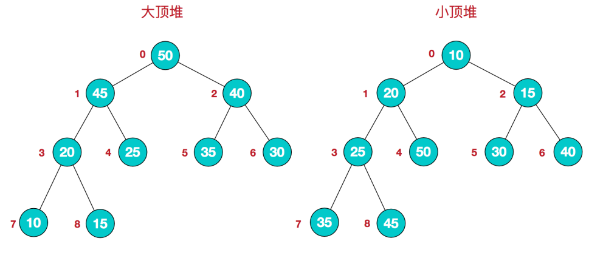
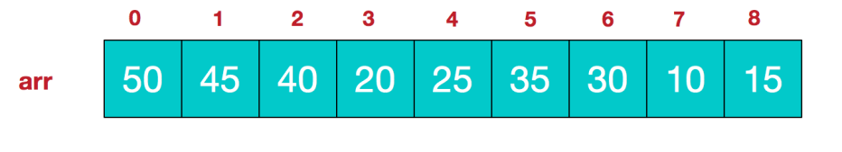

> 如需转载，请附上链接：[https://jwcen.github.io/](https://jwcen.github.io/)
{: .prompt-tip}

* This will become a table of contents (this text will be scrapped).
{:toc}

## 栈
### 232. 用两个栈实现队列
st1 进栈，st2出栈。想要用栈实现队列，需要把一个栈中的元素挨个pop()出来，再push到另一个栈中。  

~~~go
type MyQueue struct {
    stIn, stOut *list.List
}

func Constructor() MyQueue {
    return MyQueue{
        stIn: list.New(),
        stOut: list.New(),
    }
}

func (this *MyQueue) Push(x int)  {
    this.stIn.PushBack(x)
}

// Pop 只有当stOut为空的时候，再从stIn里导入数据（导入stIn全部数据）
func (this *MyQueue) Pop() int {
    if this.stOut.Len() == 0 {
        for this.stIn.Len() > 0 {
            e := this.stIn.Remove(this.stIn.Back())
            this.stOut.PushBack(e)
        }
    }

    if this.stOut.Len() > 0 {
        e := this.stOut.Remove(this.stOut.Back())
        return e.(int)
    }
    return -1
}

func (this *MyQueue) Peek() int {
    e := this.Pop()  // 直接使用已有的pop函数
    this.stOut.PushBack(e)  // 因为pop函数弹出了元素res，所以再添加回去
    return e
}

func (this *MyQueue) Empty() bool {
    return this.stIn.Len() == 0 && this.stOut.Len() == 0
}
~~~



~~~python
class MyQueue:
    def __init__(self):
        self.in_stack = []
        self.out_stack = [] 

    def push(self, x: int) -> None:
        self.in_stack.append(x)

    def pop(self) -> int:
        if self.out_stack:
            return self.out_stack.pop() 
        else:
            n = len(self.in_stack)
            for _ in range(n):
                self.out_stack.append(self.in_stack.pop())
            return self.out_stack.pop()

    def peek(self) -> int:
        elem = self.pop() 
        self.out_stack.append(elem)
        return elem

    def empty(self) -> bool:
        return not (self.in_stack or self.out_stack)
~~~


### 剑指 Offer 31. 栈的压入、弹出序列
第一个序列表示栈的压入顺序，请判断第二个序列是否为该栈的弹出顺序。  


~~~python
class Solution:
    def validateStackSequences(self, pushed: List[int], popped: List[int]) -> bool:
        stack = [] 
        i = 0 
        for v in pushed:
            stack.append(v) 
            while stack and stack[-1] == popped[i]:
                stack.pop()
                i += 1 
        return len(stack) == 0  # not stack
~~~


### 155. 最小栈
两个栈，一个正常将元素压入栈，另一个存储最小值.  


~~~python
class MinStack:
    def __init__(self):
        self.stack = [] 
        self.min = []  # 存储最小值

    def push(self, val: int) -> None:
        self.stack.append(val) 
        # 一开始也望最小值栈中添加元素
        # 再次添加元素时，该元素需要和最小值栈的比较，加入较小者
        if not self.min:
            self.min.append(val) 
        elif val < self.min[-1]:
            self.min.append(val) 
        else:
            self.min.append(self.min[-1])

    def pop(self) -> None:
        self.stack.pop() 
        self.min.pop()

    def top(self) -> int:
        return self.stack[-1]

    def getMin(self) -> int:
        return self.min[-1]
~~~


### 20. 有效的括号
第一种情况：已经遍历完了字符串，但是栈不为空，说明有相应的左括号没有右括号来匹配，所以return false  
第二种情况：遍历字符串匹配的过程中，发现栈里没有要匹配的字符。所以return false  
第三种情况：遍历字符串匹配的过程中，栈已经为空了，没有匹配的字符了，说明右括号没有找到对应的左括号return false  

~~~python
class Solution:
    def isValid(self, s: str) -> bool:
        stack = [] 
        for c in s:
            if c == '(':
                stack.append(')')
            elif c == '[':
                stack.append(']') 
            elif c == '{':
                stack.append('}')
            elif not stack or stack.pop() != c:
                return False 
        return not stack  # len(stack) == 0
~~~


### 150. 逆波兰表达式求值
逆波兰表达式，也叫做后缀表达式。  
后缀表达式是 "操作数① 操作数③ 运算符②"的顺序，运算符在两个操作数之后。  
对逆波兰表达式求值的过程是：
- 如果遇到数字就进栈；
- 如果遇到操作符，就从栈顶弹出两个数字分别为 num2（栈顶）、num1（栈中的第二个元素）；
- 计算 num1 运算 num2 .  

~~~go
func evalRPN(tokens []string) int {
    stack := []int{}
    for _, token := range tokens {
        ln := len(stack)
        switch token {
        case "+":
            stack = append(stack[:ln-2], stack[ln-2] + stack[ln-1])
        case "-":
            stack = append(stack[:ln-2], stack[ln-2] - stack[ln-1])
        case "*":
            stack = append(stack[:ln-2], stack[ln-2] * stack[ln-1])
        case "/":
            stack = append(stack[:ln-2], stack[ln-2] / stack[ln-1])
        default:
            num, _ := strconv.Atoi(token)
            stack = append(stack, num)
        }
    }

    return stack[len(stack)-1]
}
~~~



~~~python
class Solution:
    def evalRPN(self, tokens):
        stack = []
        for token in tokens:
            if token == "+":
                b = stack.pop()
                a = stack.pop()
                stack.append(a + b)
            elif token == "-":
                b = stack.pop()
                a = stack.pop()
                stack.append(a - b)
            elif token == "*":
                b = stack.pop()
                a = stack.pop()
                stack.append(a * b)
            elif token == "/":
                b = stack.pop()
                a = stack.pop()
                stack.append(int(a / b))
            else:
                stack.append(int(token))

        return stack.pop()

~~~


## 队列
### 225.两个队列模拟栈
思路：  
一个队列为主队列，一个为辅助队列，  
当入栈操作时，先添加到辅助队列，然后判断主队列是否有元素，有则将主队列内容导入辅助队列，  
然后交换 main 和 help,使得 help 队列没有在 push() 的时候始终为空队列


~~~python
class MyStack:
    def __init__(self):
        self.mainq = [] 
        self.helpq = [] 

    def push(self, x: int) -> None:
        self.helpq.append(x) 
        # 将main队列中元素全部转给help队列
        while self.mainq:
            self.helpq.append(self.mainq.pop(0))
            
        # 交换main和help,使得help队列没有在push()的时候始终为空队列
        self.mainq, self.helpq = self.helpq, self.mainq

    def pop(self) -> int:
        return self.mainq.pop(0)

    def top(self) -> int:
        return self.mainq[0]

    def empty(self) -> bool:
        return not self.mainq
~~~


## 堆
堆/优先队列是具有以下性质的完全二叉树：  
每个结点的值都大于或等于其左右孩子结点的值，称为大顶堆；或者每个结点的值都小于或等于其左右孩子结点的值，称为小顶堆。  
  
_映射到数组_  

- 大顶堆：`arr[i] >= arr[2i+1] && arr[i] >= arr[2i+2]`  
- 小顶堆：`arr[i] <= arr[2i+1] && arr[i] <= arr[2i+2]`  
堆排序则基于树的思想, 建堆的时间复杂度为 $O(N)$。  

## 相关题目  
### 剑指 Offer 40. 最小的k个数
> 1.堆排序的思想  
{: .prompt-tip}
- 核心思想是建立一个大小为k的大根堆，堆顶元素即为目前为止最大的k个数中的最大值。遍历整个数组，如果当前元素小于堆顶元素，则替换堆顶元素，并将堆进行调整，使其满足大根堆的性质。遍历完成后，堆中剩余的k个元素即为最小的k个数。  
使用堆排序的优点是可以在不对整个数组进行排序的情况下，找出最小的k个数。时间复杂度为 $O(nlogk)$，空间复杂度为 $O(k)$。  

~~~go
func getLeastNumbers(arr []int, k int) []int {
    if len(arr) == 0 || k == 0 {
        return nil 
    }

    heap := make([]int, k) 
    for i := 0; i < k; i++ {
        heap[i] = arr[i] 
    }

    buildHeap(heap)

    for i := k; i < len(arr); i++ {
        // 当前元素小于堆顶元素，替换堆顶元素，并向下调整堆
        if arr[i] < heap[0] {
            heap[0] = arr[i] 
            adjust(heap, 0, k)
        }
    }

    return heap
}

func buildHeap(heap []int) {
    n := len(heap) 
    for i := n/2-1; i >= 0; i-- {
        adjust(heap, i, n)
    }
}

func adjust(heap []int, i, n int) {
    for {
        maxPos := i 
        left, right := 2*i+1, 2*i+2 
        if left < n && heap[maxPos] < heap[left] {
            maxPos = left 
        }
        if right < n && heap[maxPos] < heap[right] {
            maxPos = right
        }
        if maxPos == i {
            break 
        }
        swap(heap, i, maxPos) 
        i = maxPos
    }
}

func swap(arr []int, i, j int) {
    arr[i], arr[j] = arr[j], arr[i]
}
~~~
  
---
> 2.快速选择（基于快排）  
{: .prompt-tip}

- 首先选择数组中的第一个元素作为轴点
- 然后进行一次快速排序的操作，将小于轴点的元素放在左边，大于轴点的元素放在右边。
- 此时，**轴点所在的位置即为数组中第几小的数**，将其与k进行比较:
  - 如果相等，则返回；
  - 如果小于k，则递归地对右边的部分进行处理；
  - 如果大于k，则递归地对左边的部分进行处理。

使用快速选择算法的时间复杂度为 $O(n)$，空间复杂度为 $O(1)$。  

~~~go
func getLeastNumbers(arr []int, k int) []int {
    n := len(arr)
    if n == 0 || k == 0 {
        return nil 
    }

    if k >= n {
        return arr 
    }

    quickSelect(arr, 0, n-1, k) 
    return arr[:k] 
}

func quickSelect(arr []int, left, right, k int) {
    if left >= right {
        return 
    }

    pivot := arr[left] 
    i, j := left, right 
    for i < j {
        /*
        交换这两个步骤的顺序会导致错误
            - 因为如果在将pivot值放回到数组的正确位置之前，需要确保右侧所有元素都大于或等于pivot值，并且左侧所有元素都小于或等于pivot值。
            - 如果首先执行arr[j] = arr[i]，则必须在将pivot值放回到数组中正确的位置之前保证arr[j]大于或等于pivot值，否则会导致错误的结果。
        */
        for i < j && arr[j] >= pivot {
            j--
        }
        arr[i] = arr[j]

        for i < j && arr[i] <= pivot {
            i++
        }
        arr[j] = arr[i] 
    }

    arr[i] = pivot //为了让pivot在数组中的正确位置
    if i == k {
        return
    } else if i < k {
        quickSelect(arr, i+1, right, k)
    } else {
        quickSelect(arr, left, i-1, k)
    }
}
~~~
  
---
> 3.快速选择（基于三路快排）  
{: .prompt-tip}

三路快排在快速排序的基础上，将数组分为小于、等于和大于轴点三部分，然后对小于和大于轴点的部分递归地进行快速排序，而对等于轴点的部分不需要进行排序。
最后，当k小于lt时，在小于部分递归地进行处理；当k大于gt时，在大于部分递归地进行处理。  
时间复杂度为 $O(n)$，空间复杂度为 $O(1)$。  

~~~go
func getLeastNumbers(arr []int, k int) []int {
    n := len(arr) 
    if n == 0 || k == 0 {
        return nil 
    }

    if k >= n {
        return arr 
    }

    quickSelect(arr, 0, n-1, k-1) 
    return arr[:k]
}

func quickSelect(arr []int, left, right, k int) {
    if left >= right {
        return
    }

    pivot := arr[left]
    lt, i, gt := left, left+1, right 
    for i <= gt {
        if arr[i] < pivot {
            swap(arr, i, lt) 
            lt++
            i++
        } else if arr[i] > pivot {
            swap(arr, i, gt) 
            gt--
        } else {
            i++
        }
    }

    if k < lt {
        quickSelect(arr, left, lt-1, k) 
    } else {
        quickSelect(arr, gt+1, right, k)
    }
}

func swap(arr []int, i, j int) {
    arr[i], arr[j] = arr[j], arr[i] 
}
~~~
  

> 在快速选择算法中，只有一侧的子数组需要进行递归处理，而另一侧的子数组不需要处理，因此时间复杂度是 $O(n)$

### 215. 数组中的第K个最大/小元素

小根堆，前k个元素直接放入。后面的元素，比堆顶大的就放入，小的不管。   
> 时间复杂度: $O(NLogK)$ ,遍历数据 $O(N)$, 堆内调整 $O(K)$  
> 空间复杂度: $O(k)$

~~~go
func findKthLargest(nums []int, k int) int {
    // 构建小根队
    arr := make([]int, k)
    for i := 0; i < k; i++ {
        arr[i] = nums[i]
    }

    buildHeap(arr, k)

    // 只要当前遍历的元素比堆顶元素大，堆顶弹出，遍历的元素进去
    for i := k; i < len(nums); i++ {
        if arr[0] < nums[i] {
            arr[0] = nums[i]
            heapify(arr, 0, k)
        }
    }

    return arr[0]
}

func buildHeap(nums []int, n int) {
    for i := n/2-1; i >= 0; i-- {
        heapify(nums, i, n)
    }
}

func heapify(nums []int, i, n int) {
    for {
        cur := i
        left, right := 2*i+1, 2*i+2

        if left < n && nums[cur] > nums[left] {
            cur = left
        }

        if right < n && nums[cur] > nums[right] {
            cur = right
        }

        if cur == i {
            break
        }

        swap(nums, i, cur)
        i = cur
    }
}
~~~


  
> 时间复杂度: $O(N)$; 空间复杂度: $O(1)$  

~~~go
func quickSelect(nums []int, left, right, k int) int {
    if left == right {
        return nums[left]
    }

    // 执行 partition 操作，返回 pivot 的位置
    pivotIndex := partition(nums, left, right)

    // pivot 在 nums 中的索引为 k
    if k == pivotIndex {
        return nums[k]
    } else if k < pivotIndex {
        // 在左侧子数组中查找第 k 大元素
        return quickSelect(nums, left, pivotIndex-1, k)
    } else {
        // 在右侧子数组中查找第 k-pivotIndex-1 大元素
        return quickSelect(nums, pivotIndex+1, right, k)
    }
}

func partiton(nums []int, left, right int) int {
	pivot := nums[left] // 可优化
	lt, i, gt := left, left+1, right
	for i <= gt {
		if nums[i] < pivot {
			swap(nums, i, lt)
			lt++
			i++
		} else if nums[i] > pivot {
			swap(nums, i, gt)
			gt--
		} else {
			i++
		}
	}
	return lt
}

func main() {
	nums := []int{3, 2, 1, 5, 6, 4}
	k := 3
	n := len(nums)

    // 第 k 小的元素在数组中的索引为 k-1
    fmt.Printf("第%d小的数为：%d\n", k, quickSelect(nums, 0, n-1, k-1))

    // 第 k 大的元素在数组中的索引为 len(nums)-k
	k = n - k
	fmt.Printf("第%d大的数为：%d\n", n-k, quickSelect(nums, 0, n-1, k))
}
~~~


### 23. 合并K个升序链表

时间：$O(nlogn)$

~~~go
func mergeKLists(lists []*ListNode) *ListNode {
    n := len(lists)
    if lists == nil || n == 0 {
        return nil
    }

    return mergeAllLists(lists, 0, n-1)
}

func mergeAllLists(lists []*ListNode, left, right int) *ListNode {
    if left > right {
        return nil
    }

    if left == right {
        return lists[left]
    }

    mid := left + (right - left) / 2
    l1 := mergeAllLists(lists, left, mid)
    l2 := mergeAllLists(lists, mid+1, right)
    return mergeTwoLists(l1, l2)
}

func mergeTwoLists(l1, l2 *ListNode) *ListNode {
    if l1 == nil {
        return l2
    }
    if l2 == nil {
        return l1
    }

    dummy := new(ListNode)
    cur := dummy
    for l1 != nil && l2 != nil {
        if l1.Val < l2.Val {
            cur.Next = l1
            l1 = l1.Next
        } else {
            cur.Next = l2
            l2 = l2.Next
        }

        cur = cur.Next
    }

    if l1 != nil {
        cur.Next = l1
    }

    if l2 != nil {
        cur.Next = l2
    }

    return dummy.Next
}
~~~



~~~go
func mergeKLists(lists []*ListNode) *ListNode {
    n := len(lists)
    if lists == nil || n == 0 {
        return nil 
    }

    heap :=[]int{}
    for i := range lists {
        head := lists[i] 
        for head != nil {
            heap = append(heap, head.Val)
            head = head.Next
        }
    }

    buildHeap(heap)

    dummy := new(ListNode)
    cur := dummy 
    for len(heap) > 0 {
        cur.Next = &ListNode{Val: heap[0]}
        cur = cur.Next 

        swap(heap, 0, len(heap)-1)
        heap = heap[:len(heap)-1]
        adjust(heap, 0, len(heap))
    }

    return dummy.Next
}

func buildHeap(heap []int) {
    n := len(heap) 
    for i := n/2-1; i >= 0; i-- {
        adjust(heap, i, n)
    } 
}

func adjust(heap []int, i, n int) {
    for {
        cur := i 
        left, right := 2*i+1, 2*i+2 

        for left < n && heap[cur] > heap[left] {
            cur = left 
        }
        for right < n && heap[cur] > heap[right] {
            cur = right 
        }

        if cur == i {
            break 
        }
        swap(heap, i, cur) 
        i = cur 
    }
}
~~~


----
参考
> 题源：leetcode.cn 