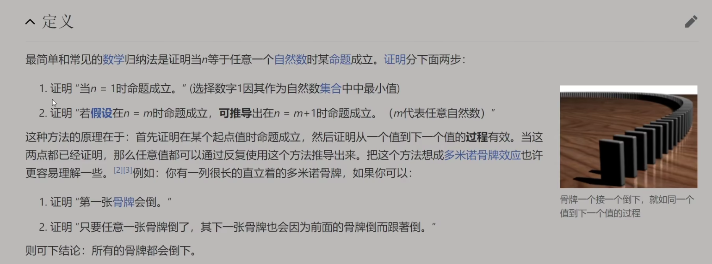

> 如需转载，请附上链接：[https://jwcen.github.io/](https://jwcen.github.io/)
{: .prompt-tip}

* This will become a table of contents (this text will be scrapped).
{:toc}

## 二叉树的分类
### 二叉树
在树的基础上限制了每个节点的子节点最多为两个，且兄弟节点之间区分左右。

### 完全二叉树
在完全二叉树中，除了最底层节点可能没填满外，**其余每层节点数都达到最大值**，并且最下面一层的节点都集中在该层最左边的若干位置。
- 叶子节点仅在最后两层出现
- 对任意节点，其右子树高度为 $h$, 则其左子树高度只能是 $h$ 或 $h + 1$

### 满二叉树
如果一棵二叉树只有度为 0 的结点和度为 2 的结点，并且度为 0 的结点在同一层上，则这棵二叉树为满二叉树。
- 深度为 $k$ 且有 $2k+1$ 个节点的二叉树 $2^{k+1}$，故
- 满二叉树不存在子节点个数为 1 的节点  

数学性质
- 对于非空二叉树，第 $i$ 层上的最大节点数目为 $2^{i}$
- 深度为 $k$ 的二叉树最多有 $2^{k+1} - 1$ 个节点，其中 $k≥−1$ 。
- 有 $n$ 个节点的完全二叉树，深度为 $k = \lfloor log_{2}(n + 1) \rfloor - 1$

## 二叉树递归底层原理
> 不要一开始就陷入细节，而是思考整棵树与其左右子树的关系。
{: prompt-tip} 

比如，求 $整棵树的最大深度 = max(左子树的最大深度, 右子树的最大深度) + 1$ .

- 原问题：计算整棵树的最大深度  
- 子问题：计算左/右子树的最大深度  

子问题 与 原问题 是相似的。  
类比循环，执行的代码也应该是相同的，但子问题需要把计算结果返回给上一级问题，这更适合用递归实现。

由于子问题的规模比原问题小，不断递归下去，总有个尽头，即递归的边界条件（直接返回它的答案【归】）。

可以用数学归纳法证明：  

## 二叉树的遍历
### 深度优先遍历 - 先往深走，遇到叶子节点再往回走。 

**前序遍历**常用在序列化以及建树过程中。其中每个序列化都对应一个反序列化，反序列化是根据序列化的规则进行建树。   
- 前序遍历的顺序为“根左右”  

**中序遍历**: 中序遍历常用在二叉搜索树中，因为二叉搜索树有个很好的性质是它的中序遍历是有序的。 
- 中序遍历的顺序为“左根右”  

**后序遍历**经常用在树形 DP 中。即：根节点的计算结果需要使用到左右子树的计算结果，因此需要先计算左右两个子节点，返回结果后才能计算当前节点。 
- 后序遍历的顺序为“左右根”


~~~go
// 前序遍历
func preorderTraversal(root *TreeNode) []int {
    res := []int{}
    var dfs func(*TreeNode)
    dfs = func(root *TreeNode) {
        if root == nil {
            return
        }

        res = append(res, root.Val)
        dfs(root.Left)
        dfs(root.Right)
    }

    dfs(root)
    return res
}

// ----------中序遍历----------------
func inorderTraversal(root *TreeNode) (res []int) {
    var dfs func(*TreeNode)
    dfs = func(root *TreeNode) {
        if root == nil {
            return 
        }

        dfs(root.Left)
        res = append(res, root.Val)
        dfs(root.Right)
    }

    dfs(root)
    return 
}

// -----后序遍历-------------
func postorderTraversal(root *TreeNode) (res []int) {
    var dfs func(*TreeNode)
    dfs = func(root *TreeNode) {
        if root == nil {
            return
        }
        dfs(root.Left)
        dfs(root.Right)
        res = append(res, root.Val)
    }
    dfs(root)
    return
}
~~~


> 时间复杂度：所有遍历的节点数目，即二叉树的节点总数，因此为 $O(n)$。
> 空间复杂度：递归调用栈的深度，即二叉树的高度，因此最坏情况下为 $O(n)$，最好情况下为 $O(logn)$，其中n为节点总数。


~~~go
/*
    初始化一个栈和一个结果数组。
    将根节点入栈。
    当栈不为空时，从栈中取出一个节点，将它的值加入结果数组中，
     并将其右子节点入栈，再将其左子节点入栈。
*/
func preorderTraversal(root *TreeNode) []int {
    var stack []*TreeNode
    var result []int

    node := root
    for node != nil || len(stack) > 0 {
        if node != nil {
            stack = append(stack, node)
            // 加入结果数组
            result = append(result, node.Val)
            node = node.Left
        } else {
            node = stack[len(stack)-1]
            stack = stack[:len(stack)-1]
            node = node.Right
        }
    }

    return result
}

//-----------------
/*
    初始化一个栈和一个结果数组。
    将根节点入栈。
    当栈不为空时，从栈中取出一个节点，如果它有左子节点，则将左子节点入栈，否则将它的值加入结果数组中，并将其右子节点入栈。

需要注意的是，由于栈是后进先出的结构，所以先将所有左子节点入栈，以保证遍历顺序为“左根右”。
*/
func inorderTraversal(root *TreeNode) []int {
    var stack []*TreeNode
    var result []int

    node := root
    for node != nil || len(stack) > 0 {
        if node != nil {
            stack = append(stack, node)
            node = node.Left
        } else {
            node = stack[len(stack)-1]
            stack = stack[:len(stack)-1]
            result = append(result, node.Val)
            node = node.Right
        }
    }

    return result

// -------------
/*
首先，当访问一个节点时，需要将其值添加到结果数组中，并将该节点的右子节点压入栈中。
然后，继续遍历该节点的左子节点，直到左子节点为空。
此时，从栈中弹出一个节点并访问其左子节点，
    如果该节点的右子节点存在并且没有被访问过，
    那么需要将该节点重新压入栈中，并遍历其右子节点。
    如果该节点的右子节点已经被访问过，那么直接访问该节点并弹出。

最后，由于我们先访问了左子树和右子树，再访问根节点，因此需要将结果数组翻转才能得到正确的后序遍历结果。
*/
func postorderTraversal(root *TreeNode) []int {
    var stack []*TreeNode
    var result []int

    node := root
    for node != nil || len(stack) > 0 {
        if node != nil {
            stack = append(stack, node)
            result = append(result, node.Val)
            // 右子结点先入栈
            node = node.Right
        } else {
            node = stack[len(stack)-1]
            stack = stack[:len(stack)-1]
            node = node.Left
        }
    }

    reverse(result)
    return result
}

func reverse(result []int) {
    i, j := 0, len(result)-1
    for i < j {
        result[i], result[j] = result[j], result[i]
        i++
        j--
    }
}
~~~



~~~go
type tuple []interface{}

func preorderTraversal(root *TreeNode) []int {
    var res []int 
    if root == nil {
        return res 
    }

    stack := []tuple{ {false, root} }
    for len(stack) > 0 {
        n := len(stack)
        top := stack[n-1] 
        visited, node := top[0].(bool), top[1].(*TreeNode)
        stack = stack[:n-1] 

        if node == nil { continue }

        if !visited {
            // 其他序的遍历，调整此处
            stack = append(stack, tuple{false, node.Right})
            stack = append(stack, tuple{false, node.Left})
            stack = append(stack, tuple{true, node})
        } else {
            res = append(res, node.Val) 
        }
    }
    return res 
}
~~~


时间复杂度均为O(n)，其中n为二叉树中的节点数。这是因为对于每个节点，我们都只会访问一次，并且每次入栈和出栈的操作都是O(1)的。

### 广度优先遍历
**层序遍历**首先访问根节点，然后访问根节点的所有第一层子节点，然后访问所有第二层子节点，以此类推。  
同一层之间以及不同层之间访问的先后顺序用队列维护。每次出队一个节点作为当前节点，它的两个左右子节点分别进队，队列中的数据顺序就是层序遍历的顺序。


~~~go
// -----1-----
func levelOrder(root *TreeNode) [][]int {
    var res [][]int 
    if root == nil {
        return res 
    }

    curLevel := []*TreeNode{root} 
    for len(curLevel) > 0 {
        n := len(curLevel)
        nextLevel := make([]*TreeNode, 0, n) 
        tmp := make([]int, n)
        for i, node := range curLevel {
            tmp[i] = node.Val 
            if node.Left != nil {
                nextLevel = append(nextLevel, node.Left)
            }
            if node.Right != nil {
                nextLevel = append(nextLevel, node.Right)
            }
        }
        res = append(res, tmp) 
        curLevel = nextLevel
    }
    return res 
}

// -----2-----
func levelOrder(root *TreeNode) [][]int {
    var res [][]int 
    if root == nil {
        return res 
    }

    que := []*TreeNode{root} 
    for len(que) > 0 {
        l := len(que) 
        vals := make([]int, l) 
        for i := 0; i < l; i++ {
            node := que[0] 
            que = que[1:]
            vals[i] = node.Val

            if node.Left != nil {
                que = append(que, node.Left)
            }
            if node.Right != nil {
                que = append(que, node.Right)
            }
        }
        res = append(res, vals) 
    }
    return res 
}
~~~


### 从后序和中序遍历二叉树

- 以【后序数组】的最后一个元素为【切割点】
- 找到切割点在中序数组的位置，先切【中序数组】，再根据中序数组反过来切【后序数组】。
- 一层一层（递归）切下去，每次后序数组的最后一个元素就是节点元素。

~~~go
func buildTree(inorder []int, postorder []int) *TreeNode {
    if len(inorder) < 1 {
        return nil
    }
    // 先找到根节点(后序数组最后一个元素)
    nodeVal := postorder[len(postorder)-1]  

    // 找到根节点在中序数组的位置，以此位置作为分割点
    left := findSplitIdx(inorder, nodeVal)  // left在中、后数组一样的

    // 构造root
    root := &TreeNode{
        Val: nodeVal,
        Left: buildTree(inorder[:left], postorder[:left]),
        Right: buildTree(inorder[left+1:], postorder[left:len(postorder)-1])}
    
    return root
}

func findSplitIdx(inorder []int, val int) int {
    for i, v := range inorder {
        if v == val {
            return i
        }
    }
    return -1
}
~~~


### 从前序和中序构造二叉树

~~~go
func buildTree(preorder []int, inorder []int) *TreeNode {
    if len(preorder) < 1 {
        return nil
    }

    root := preorder[0] // 从前序遍历找中序遍历的根节点
    i := findRootIdx(inorder, root)

    return &TreeNode{
        Val : root,
        Left: buildTree(preorder[1:i+1], inorder[:i]),
        Right: buildTree(preorder[i+1:], inorder[i+1:]),
    }
}

func findRootIdx(inorder []int, val int) int {
    for i, num := range inorder {
        if val == num {
            return i
        }
    }
    return -1
}
~~~


### 为什么二叉树不能由前序遍历和后序遍历确定？
前序和后序在本质上都是**将父节点与子结点进行分离，但并没有指明左子树和右子树的能力**，因此得到这两个序列只能明确父子关系，而不能确定一个二叉树。

## 题目
### 104.二叉树的最大深度

~~~go
func maxDepth(root *TreeNode) int {
    if root == nil {
        return 0 
    }

    leftH := maxDepth(root.Left) 
    rightH := maxDepth(root.Right)
    return max(leftH, rightH) + 1 
}

func max(a, b int) int { if a < b { return b}; return a }
~~~



~~~go
func maxDepth(root *TreeNode) int {
    var ans int 
    var dfs func(*TreeNode, int) 
    dfs = func(root *TreeNode, depth int) {
        if root == nil {
            return
        }
        depth++ 
        ans = max(ans, depth)
        dfs(root.Left, depth) 
        dfs(root.Right, depth)
    }

    dfs(root, 0) 
    return ans 
}
~~~


### 100. 相同的树

~~~go
func isSameTree(p *TreeNode, q *TreeNode) bool {
    if p == nil || q == nil {
        return p == q  
    }

    return p.Val == q.Val && isSameTree(p.Left, q.Left) && isSameTree(p.Right, q.Right)
}
~~~


### 110. 平衡二叉树

~~~go
func isBalanced(root *TreeNode) bool {
    if root == nil {
        return true 
    }

    return getHeight(root) != -1 
}

func getHeight(root *TreeNode) int {
    if root == nil {
        return 0
    }

    left := getHeight(root.Left) 
    if left == -1 {
        return -1 
    }

    right := getHeight(root.Right) 
    if right == -1 || abs(left - right) > 1 {
        return -1 
    }

    return max(left, right) + 1 
}
~~~


### 199. 二叉树的右视图
1. 先递归右子树，再递归左子树
2. 递归同时记录一个节点个数/递归深度，如果递归深度 == 答案的长度，则该节点需记录到答案中  


~~~go
func rightSideView(root *TreeNode) []int {
    var res []int 
    var dfs func(*TreeNode, int) 
    dfs = func(root *TreeNode, depth int) {
        if root == nil {
            return 
        }
        if depth == len(res) {
            res = append(res, root.Val)
        }

        dfs(root.Right, depth+1)
        dfs(root.Left, depth+1)
    }

    dfs(root, 0)
    return res 
}
~~~


### 103. 二叉树的锯齿形层序遍历

~~~go
func zigzagLevelOrder(root *TreeNode) [][]int {
    var res [][]int 
    if root == nil {
        return res 
    }

    flag := false 
    curLevel := []*TreeNode{root} 
    for len(curLevel) > 0 {
        n := len(curLevel) 
        nextLevel := make([]*TreeNode, 0, n) 
        tmp := make([]int, 0, n) 
        for _, node := range curLevel {
            if flag {
                tmp = append([]int{node.Val}, tmp...)    
            } else {
                tmp = append(tmp, node.Val)
            }
            
            if node.Left != nil {
                nextLevel = append(nextLevel, node.Left)
            }
            if node.Right != nil {
                nextLevel = append(nextLevel, node.Right)
            }
        }
        res = append(res, tmp) 
        curLevel = nextLevel 
        flag = !flag
    }

    return res 
}
~~~


### 513. 找树左下角的值
从右往左遍历，把右儿子先入队，再左儿子入队；出队就是右先出、左再出了=>保证每一层都是从右往左遍历，那么最后一个出对的就是答案	  


~~~go
func findBottomLeftValue(root *TreeNode) int {
    var node *TreeNode
    q := []*TreeNode{root}

    for len(q) > 0 {
        node = q[0]
        q = q[1:]

        if node.Right != nil {
            q = append(q, node.Right)
        }

        if node.Left != nil {
            q = append(q, node.Left)
        }
    }

    return node.Val
}
~~~


----
参考

> 如需转载，请附上链接：[https://jwcen.github.io/](https://jwcen.github.io/)
{: .prompt-tip}