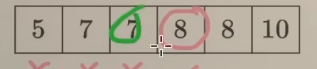
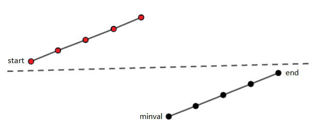

> 如需转载，请附上链接：[https://jwcen.github.io/](https://jwcen.github.io/)
{: .prompt-tip}

* This will become a table of contents (this text will be scrapped).
{:toc}

## 闭区间和开区间写法

~~~go
func lowerBound(nums []int, target int) int {
    left := 0
    right := len(nums)-1            
    for left <= right {            
        mid := (left + right) / 2
        if nums[mid] < target {
            left = mid+1            
        } else { 
            right = mid-1           
        }
    }
    return left 
}
~~~



~~~go
func lowerBound(nums []int, target int) int {
    left := -1
    right := len(nums)              // 开区间(left, right)
    for left+1 < right {            // 区间不为空
        mid := (left + right) / 2
        if nums[mid] < target {
            left = mid             // (mid, right)
        } else { 
            right = mid            // (left, mid)
        }
    }
    return right 
}
~~~


### 有序数组上二分查找的四种类型
如何处理 $>=x$, $>x$, $<=x$, $<x$  

这四种可以互相转化。
- 对于 $>x$ 来说，可以看成 $>=x+1$；
- 对于 $<x$，可看成 $(>=x)-1$，即$>=x$的左边那个数
  - {: width="200", height="100"}
  - 比如，$<8$，$>=8$ 左边那个数就是 $7$
- 对于 $<=x$, 可看成 $(>x)-1$ 或 $(>=x+1)-1$，即 $>x$ 左边的那个数

## 相关题目
### 34. 在排序数组中查找元素的第一个和最后一个位置
- 开始位置（>=target)，结束位置(<=target)
- 时间 $O(logn)$：每次数组都取半


~~~go
func searchRange(nums []int, target int) []int {
    start := lowerBound(nums, target)  // >= target
    // 所有数小于target或数组为空，或者根本不等于target
    if start == len(nums) || nums[start] != target {
        return []int{-1, -1}
    }

    end := lowerBound(nums, target+1) - 1  // <= target
    return[]int{start, end} 
}

func lowerBound(nums []int, target int) int {
    left := -1
    right := len(nums)              // 开区间(left, right)
    for left+1 < right {            // 区间不为空
        mid := (left + right) / 2
        if nums[mid] < target {
            left = mid             // (mid, right)
        } else { 
            right = mid            // (left, mid)
        }
    }
    return right 
}
~~~


### 162. 寻找峰值
题目：数组可能包含多个峰值，在这种情况下，返回 任何一个峰值 所在位置即可。  
- 1.峰值一定在数组中，2.对于所有有效的 i 都有 nums[i] != nums[i + 1]

思路：二分 
不断向右边爬坡：
- nums[i] < nums[mid+1] 上坡--峰顶左侧
- nums[i] > nums[mid+1] 下坡--峰顶或峰顶右侧

根据这一定义，数组最后一个元素肯定是在上坡


~~~go
func findPeakElement(nums []int) int {
    // [0, n-2] => (-1, n-1)
    left, right := -1, len(nums)-1
    for left+1 < right {
        mid := (left + right) / 2 
        if nums[mid] < nums[mid+1] {
            left = mid 
        } else {
            right = mid 
        }
    }
    return right
}
~~~


### 153. 寻找旋转排序数组中的最小值
题目要求找出最小的点，即图中的 minval 点，**具体点就是数组中第一个小于 nums[end] 的数字**，为什么不能是第一个小于 nums[start] 的数字呢，因为仅仅在该情况下看似可行，但是当数组元素严格递增时，没有比 nums[start] 更小的数字了，所以不能使用 nums[start] 作为指标。
{: width="400", height="300"}
- mid 可能定位在左边（即图中的红色部分，也即 nums[mid] > nums[end]）,此时我们需要调整 start 的位置到 mid 处;
- mid 可能定位在右边（即图中的蓝色部分，也即 nums[mid] < nums[end]）,此时我们需要调整 end 的位置到 mid 处;


~~~go
func findMin(nums []int) int {
    n := len(nums)
    left, right := -1, n-1 
    for left+1 < right {
        mid := (left + right) / 2
        if nums[mid] < nums[n-1] {  // 和最后一个元素比较，判断最小值在哪个区间
            right = mid             // 收缩右边届
        } else {
            left = mid
        }
    }
    return nums[right]
}
~~~



- 如果 nums[mid] > nums[right]，那么最小值一定在 [mid+1, right] 这个区间内，因此我们可以将 left 更新为 mid+1；
- 如果 nums[mid] < nums[right]，那么最小值可能就是 nums[mid]，或者在 [left, mid] 这个区间内，因此我们可以将 right 更新为 mid；
- 如果 nums[mid] == nums[right]，我们无法确定最小值在哪一侧，但可以将 right 减一，因为此时可以确定最小值一定在 [left, right-1] 这个区间内。

~~~go
func findMin(nums []int) int {
    left, right := 0, len(nums)-1 
    for left <= right {
        mid := (left + right) / 2
        if nums[mid] > nums[right] {
            left = mid+1
        } else if nums[mid] < nums[right] {
            right = mid 
        } else {
            right--
        }
    }
    return nums[left]
}
~~~


### 154. 寻找旋转排序数组中的最小值2-包含重复元素

~~~go
func findMin(nums []int) int {
    left, right := -1, len(nums)-1 
    for left+1 < right {
        mid := left + (right - left) / 2
        if nums[mid] < nums[right] {
            right = mid 
        } else if nums[mid] > nums[right] {
            left = mid
        } else { // 重复元素，那么right--继续进入下一轮循环
            right--
        }
    }
    return nums[right]
}
~~~


### 33. 搜索旋转排序数组
整数数组 nums 按升序排列，数组中的值 **互不相同** 。
存在目标值 target ，则返回它的下标，否则返回 -1 。


~~~go
func search(nums []int, target int) int {
    peakIdx := findPeakIdx(nums) 
    // 判断target出现在哪个单调段
    // 在左边上升段
    if target >= nums[0] && target <= nums[peakIdx] {
        return bSearch(nums, 0, peakIdx, target)
    } 
    // target在右边上升段
    return bSearch(nums, peakIdx+1, len(nums)-1, target)
}

// findPeakIdx 找到峰值元素所在索引
func findPeakIdx(nums []int) int {
    n := len(nums) 
    if n == 1 {
        return 0
    }

    left, right := 0, n-2 // 这是因为峰值点的位置不能是数组的第一个或最后一个元素。
    for left <= right {
        mid := (left + right) / 2
        if nums[mid] > nums[mid+1] { // 找到峰值点
            return mid 
        } else if nums[mid] >= nums[left] {
            left = mid+1 
        } else {
            right = mid-1
        }
    }
    return 0
}

func bSearch(nums []int, left, right, target int) int {
    for left <= right {
        mid := (left + right) / 2 
        if nums[mid] == target {
            return mid 
        } else if nums[mid] < target {
            left = mid+1 
        } else {
            right = mid-1
        }
    }
    return -1
}
~~~



具体思路如下：

- 我们首先设定左指针和右指针，分别指向数组的起始位置和结束位置。

- 然后我们可以找到中间位置 mid，判断 nums[mid] 和 target 的关系。

- 如果 nums[mid] == target，那么我们直接返回 mid。

- 如果 nums[mid] < nums[right]，那么说明右半段是升序排列的，如果 target 在右半段，那么我们可以继续在右半段中查找，否则我们在左半段中查找。

- 如果 nums[mid] > nums[right]，那么说明左半段是升序排列的，如果 target 在左半段，那么我们可以继续在左半段中查找，否则我们在右半段中查找。

- 如果上述情况都没有找到 target，那么说明 target 不在数组中，返回 -1。

时间复杂度为 O(log n)，空间复杂度为 O(1)。  

~~~go
func search(nums []int, target int) int {
    //1. 首先设定左指针和右指针，分别指向数组的起始位置和结束位置。
    left, right := 0, len(nums)-1

    for left <= right {
        // 2. 然后可以找到中间位置 mid，判断 nums[mid] 和 target 的关系。
        mid := (left + right) / 2

        // 如果 nums[mid] == target，那么我们直接返回 mid。
        if nums[mid] == target {
            return mid 
        }
        
        if nums[mid] < nums[right] { // 说明右半段是升序排列的
            //如果 target 在右半段，那么可以继续在右半段中查找，否则在左半段中查找。
            if nums[mid] < target && target <= nums[right] {
                left = mid + 1 
            } else {
                right = mid - 1
            }
        } else { // nums[mid] >= nums[right]，那么说明左半段是升序排列的
            //如果 target 在左半段，那么可以继续在左半段中查找，否则在右半段中查找。
            if nums[left] <= target && target < nums[mid] {
                right = mid - 1
            } else {
                left = mid + 1
            }
        }
    }
    return -1
}
~~~


### 81. 搜索旋转排序数组 II-(数组元素可能重复)

解题思路：  
因为这道题是对搜索旋转排序数组的一个变形（含重复元素），思路同 33.
- 如果 nums[mid] == nums[right]，那么说明右半段全部都是相等的数，我们可以将右边界 right 减一，重新开始查找。
- 如果上述情况都没有找到 target，那么说明 target 不在数组中，返回 false。


~~~go
func search(nums []int, target int) bool {
    left, right := 0, len(nums)-1
    for left <= right {
        mid := (left + right) / 2
        if nums[mid] == target {
            return true 
        }

        if nums[mid] < nums[right] {
            if nums[mid] < target && target <= nums[right] {
                left = mid + 1 
            } else {
                right = mid - 1
            }
        } else if nums[mid] > nums[right] {
            if nums[left] <= target && target < nums[mid] {
                right = mid - 1
            } else {
                left = mid + 1
            }
        } else { // nums[mid] == nums[right]
            right--
        }
    }
    return false 
}
~~~


----
参考

> 如需转载，请附上链接：[https://jwcen.github.io/](https://jwcen.github.io/)
{: .prompt-tip}