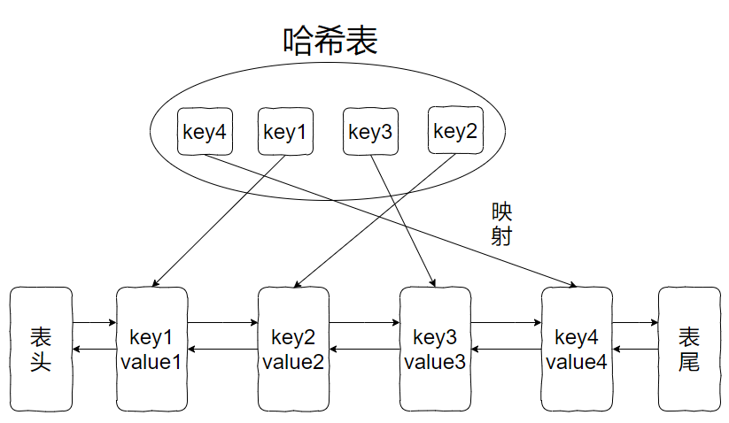

> 如需转载，请附上链接：[https://jwcen.github.io/](https://jwcen.github.io/)
{: .prompt-tip}

* This will become a table of contents (this text will be scrapped).
{:toc}

## 要求
请你设计并实现一个满足  LRU (最近最少使用) 缓存 约束的数据结构。
实现 LRUCache 类：
- `LRUCache(int capacity)` 以 正整数 作为容量 capacity 初始化 LRU 缓存
- `int get(int key)` 如果关键字 key 存在于缓存中，则返回关键字的值，否则返回 -1 。
- `void put(int key, int value)` 如果关键字 key 已经存在，则变更其数据值 value ；如果不存在，则向缓存中插入该组 key-value 。如果插入操作导致关键字数量超过 capacity ，则应该 逐出 最久未使用的关键字。

> 函数 get 和 put 必须以 $O(1)$ 的平均时间复杂度运行。

### 分析  
LRU 缓存算法的核心数据结构就是哈希表 + 双向链表：  
- 哈希表用来快速查找元素，双向链表用来维护元素的顺序。
- 最近使用的元素排在链表的前面，最久未使用的元素排在链表的后面。
- 当缓存已满时，删除链表的最后一个元素，同时从哈希表中删除该元素的键值对。

_LRU 数据结构_  

### 为什么要是双向链表，那单链表？
- 双向链表保证节点的插入、删除、移动等操作的**时间复杂度** $O(1)$。
  - 通过前驱节点和后继节点可以快速进行节点插入和删除，也可以快速将某个节点移动到链表头部或者尾部。
- 单向链表只能通过后继节点指针进行**遍历**，对于节点的插入、删除和移动操作就不如双向链表方便。

### 哈希表中已经存了 key，为什么链表中还要存 key 和 val 呢，只存val不行？
当缓存容量已满，不仅要删除最后一个 Node 节点，还要把 map 中映射到该节点的 key 同时删除，**而这个 key 只能由 Node 得到**。  
如果 Node 结构中只存储 val，就无法得知 key 是什么，就无法删除 map 中的 key，造成错误。

### code 实现

~~~go
type entry struct {
	key, value int
}

type LRUCache struct {
	cap   int
	cache map[int]*list.Element
	lst   *list.List
}

func Constructor(capacity int) LRUCache {
	return LRUCache{
		cap:   capacity,
		cache: map[int]*list.Element{},
		lst:   list.New(),
	}
}

func (c *LRUCache) Get(key int) int {
	e := c.cache[key]
	if e == nil {
		return -1
	}

	c.lst.MoveToFront(e) // 刷新缓存使用时间
	return e.Value.(entry).value
}

func (c *LRUCache) Put(key int, value int) {
	if e := c.cache[key]; e != nil {
		e.Value = entry{key, value} // 已存在则更新
		c.lst.MoveToFront(e)        // 刷新缓存使用时间
		return
	}

	// 缓存中没有，直接添加到首位
	c.cache[key] = c.lst.PushFront(entry{key, value})
	if len(c.cache) > c.cap {
		// 删除缓存，链表也要删除key
		e := c.lst.Remove(c.lst.Back())
		rmKey := e.(entry).key
		delete(c.cache, rmKey)
	}
}

/**
 * Your LRUCache object will be instantiated and called as such:
 * obj := Constructor(capacity);
 * param_1 := obj.Get(key);
 * obj.Put(key,value);
 */
~~~



~~~go
// Node 双向链表
type Node struct {
	key  int
	val  int
	prev *Node
	next *Node
}

// LRUCache 结构体
type LRUCache struct {
	size  int
	cache map[int]*Node
	head  *Node
	tail  *Node
}

// Constructor 返回一个LRUCache实例
func Constructor(capacity int) LRUCache {
	head, tail := new(Node), new(Node)
	head.next = tail
	tail.prev = head
	return LRUCache{
		size:  capacity,
		cache: make(map[int]*Node),
		head:  head,
		tail:  tail,
	}
}

// deleteNode 从当前位置删除节点
func (lru *LRUCache) deleteNode(node *Node) {
	node.next.prev = node.prev
	node.prev.next = node.next
}

// addToHead 移动到前面的真正逻辑实现
func (lru *LRUCache) addToHead(node *Node) {
	lru.head.next.prev = node
	node.next = lru.head.next
	node.prev = lru.head
	lru.head.next = node
}

// moveToFront 移动到前面
func (lru *LRUCache) moveToFront(node *Node) {
	lru.deleteNode(node)
	lru.addToHead(node)
}

// removeTail 删除最后一个元素
func (lru *LRUCache) removeTail() {
	tail := lru.tail.prev
	delete(lru.cache, tail.key)
	lru.deleteNode(tail)
}

func (lru *LRUCache) Get(key int) int {
	if node, ok := lru.cache[key]; ok {
		lru.moveToFront(node)
		return node.val
	}
	return -1
}

func (lru *LRUCache) Put(key int, value int) {
	if node, ok := lru.cache[key]; ok {
		node.val = value
		lru.moveToFront(node)
		return
	}

	if len(lru.cache) == lru.size {
		lru.removeTail()
	}

	newNode := &Node{key: key, val: value}
	lru.pushHead(newNode)
	lru.cache[key] = newNode
}
~~~


## 进阶要求：带过期时间
带过期时间的LRU缓存可以通过在缓存中维护一个过期时间的字段来实现。
- 结构体增加了一个过期时间`expireTime`字段
- Get操作中，需要检查键值对是否过期，如果过期了就需要从缓存中删除。
- Put操作中，需要为新插入的键值对设置过期时间，并在移动节点到链表头部时更新过期时间。


~~~go
func main() {
	obj := Constructor(3)
	fmt.Printf("obj.Get(1): %v\n", obj.Get(1)) // -1
	obj.Put(1, 111, 3*time.Second)
	obj.Put(2, 222, 4*time.Second)
	fmt.Printf("obj.Get(1): %v\n", obj.Get(1))

	time.Sleep(3 * time.Second)
	fmt.Println("After 3s ...")
	fmt.Printf("obj.Get(1): %v\n", obj.Get(1))
	fmt.Printf("obj.Get(2): %v\n", obj.Get(2))
	time.Sleep(1 * time.Second)
	fmt.Println("After 4s ...")
	fmt.Printf("obj.Get(2): %v\n", obj.Get(2))
}

// Node 双向链表
type Node struct {
	key, val   int
	expireTime time.Time
	prev, next *Node
}

// LRUCache 结构体
type LRUCache struct {
	size  int
	cache map[int]*Node
	head  *Node
	tail  *Node
}

// Constructor 返回一个LRUCache实例
func Constructor(capacity int) LRUCache {
	head, tail := new(Node), new(Node)
	head.next = tail
	tail.prev = head
	return LRUCache{
		size:  capacity,
		cache: make(map[int]*Node),
		head:  head,
		tail:  tail,
	}
}

// deleteNode 从当前位置删除节点
func (lru *LRUCache) deleteNode(node *Node) {
	node.next.prev = node.prev
	node.prev.next = node.next
}

// pushHead 移动到前面的真正逻辑实现
func (lru *LRUCache) pushHead(node *Node) {
	lru.head.next.prev = node
	node.next = lru.head.next
	node.prev = lru.head
	lru.head.next = node
}

// moveToFront 移动到前面
func (lru *LRUCache) moveToFront(node *Node) {
	lru.deleteNode(node)
	lru.pushHead(node)
}

// removeTail 删除最后一个元素
func (lru *LRUCache) removeTail() {
	tail := lru.tail.prev
	delete(lru.cache, tail.key)
	lru.deleteNode(tail)
}

func (lru *LRUCache) Get(key int) int {
	node, exist := lru.cache[key]
	// key 存在 且 未过期
	if exist && node.expireTime.After(time.Now()) {
		lru.moveToFront(node)
		return node.val
	}

	// key存在且过期则删除
	lru.Remove(key)
	return -1
}

func (lru *LRUCache) Put(key, value int, ttl time.Duration) {
	if node, ok := lru.cache[key]; ok {
		// 更新值和过期时间
		node.val = value
		node.expireTime = time.Now().Add(ttl)
		lru.moveToFront(node)
		return
	}

	if len(lru.cache) == lru.size {
		lru.removeTail()
	}

	newTime := time.Now().Add(ttl)
	newNode := &Node{key: key, val: value, expireTime: newTime}
	lru.pushHead(newNode)
	lru.cache[key] = newNode
}

// Remove 用于从缓存中删除某个键值对。
func (lru *LRUCache) Remove(key int) {
	if node, ok := lru.cache[key]; ok {
		lru.deleteNode(node)
		delete(lru.cache, key)
	}
}
~~~


----
> 如需转载，请附上链接：[https://jwcen.github.io/](https://jwcen.github.io/)
{: .prompt-tip}