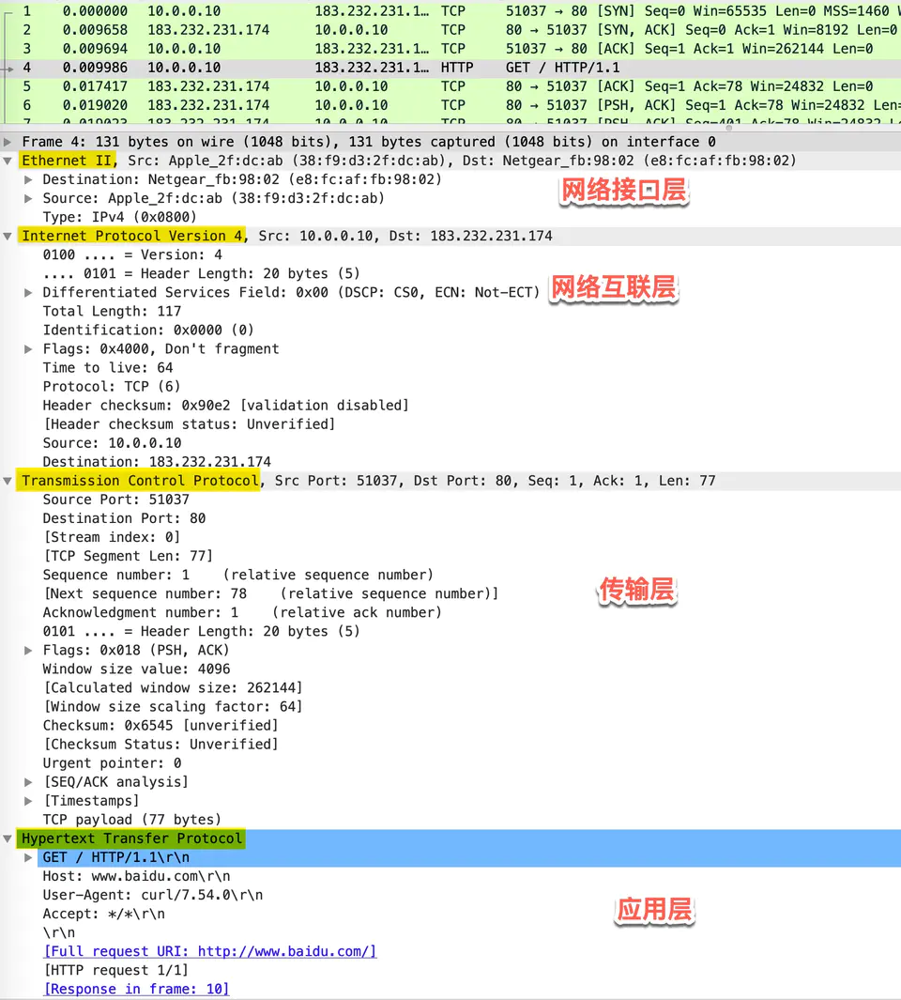
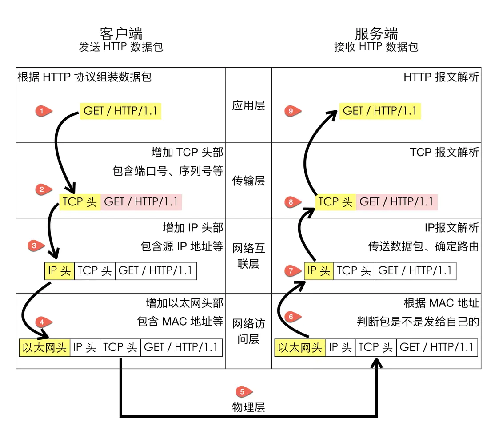

**自底向上依次为：**

- Ethernet II：网络接口层以太网帧头部信息
- Internet Protocol Version 4：互联网层 IP 包头部信息
- Transmission Control Protocol：传输层的数据段头部信息，此处是 TCP 协议
- Hypertext Transfer Protocol：应用层 HTTP 的信息

{: width="700" height="400" }_抓包查看协议的分层_

  

**为什么要分层，分层的好处？**  
> 本质是通过**分离关注点而让复杂问题简单化**，通过分层可以做到：
>  - **各层独立**：限制了依赖关系的范围，各层之间使用标准化的接口，不需要知道上下层是如何工作的，增加或者修改一个应用层协议不会影响传输层协议
> - **灵活性更好**：比如路由器不需要应用层和传输层，分层以后路由器就可以只用加载更少的几个协议层
> - **易于测试和维护**：可以独立的测试特定层，某一层有了更好的实现可以整体替换掉
> - **能促进标准化**：每一层职责清楚，方便进行标准化

## 应用层
应用层只需要专注于为用户提供应用服务，比如 FTP文件传输服务、DNS解析服务、SMTP邮件服务等。

应用层的本质是规定了**应用程序之间如何相互传递报文**， 以 HTTP 协议为例，它规定了：
- **报文的类型**（请求报文/响应报文）
- **报文的语法**，分为几段，各段含义、如何分隔，各部分的各个字段的含义
- **进程**应该以什么样的时序发送报文和处理响应报文

{: width="500" height="300" }_http请求报文格式_

**应用层有哪些基于TCP的协议**
> - SSH 安全登录、文件传送(SCP)和端口重定向
> - FTP 文件传输协议
> - SMTP Simple Mail Transfer Protocol (E-mail) 简单邮件传输协议
> - HTTP 超文本传送协议
> - HTTPS used for securely transferring web pages 

**应用层有哪些基于UDP的协议**
> - **DNS**（Domain Name System），用于将域名解析为IP地址。
> - **DHCP**（Dynamic Host Configuration Protocol），用于在网络中动态分配IP地址。
> - **SNMP**（Simple Network Management Protocol），用于管理网络设备。
> - **RDP**（Remote Desktop Protocol），用于远程桌面连接。
> - **TFTP**（Trivial File Transfer Protocol），用于简单的文件传输。
> - **NTP**（Network Time Protocol），用于在网络中同步时间。
> - **SIP**（Session Initiation Protocol），用于语音和视频通信。

> DNS既可以基于TCP，也可以基于UDP。
{: .prompt-tip } 

## 传输层
应用层的数据包会传给传输层。
**传输层的作用是为两台主机之间的「应用进程」提供端到端的逻辑通信**，相隔几千公里的两台主机的进程就好像在直接通信一样。

> 虽然叫传输层，但是并不是将数据包从一台主机传送到另一台，而是**对「传输行为进行控制」**。
{: .prompt-tip } 

### TCP 和 UDP 
UDP 是无连接的协议，而 TCP 是可靠的有连接的协议，主要表现在：
- 接收方会对收到的数据进行**确认**、发送方会**重传**接收方未确认的数据、接收方会将接收到数据按正确的顺序重新**排序**，并的数据、提供了**拥塞控制**的机制。**删除重复**

### TCP Segment
由于 HTTP 使用的是 TCP 协议，为了方便通信，将 HTTP 请求报文按序号分为多个报文段(segment)，并对每个报文段进行封装。

## 网络层
sdd

## 网络接口层（数据链路层+物理层）
综上  
{: width="600" height="300" }_TCP/IP四层体系结构_

