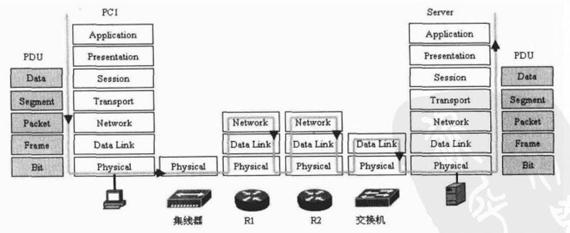

> 如需转载，请附上链接：[https://jwcen.github.io/](https://jwcen.github.io/)
{: .prompt-tip}

* This will become a table of contents (this text will be scrapped).
{:toc}


## 构建请求
### 1. 浏览器解析 URL
对 URL 进行解析之后，浏览器确定了 **Web 服务器和文件名**，下面根据这些信息生成 HTTP 请求报文。

### 2. 应用层进行 DNS 解析
**通过 DNS 将域名解析成IP地址。** 在解析过程中，按照`浏览器缓存`、`系统缓存`、`路由器缓存`、`ISP(运营商)的DNS缓存`、`根域名服务器`、`顶级域名服务器`、`主域名服务器`的顺序，逐步读取缓存，直到拿到IP地址。
> 这里使用**DNS预解析**，可以根据浏览器定义的规则，提前解析之后可能会用到的域名，使解析结果缓存到`系统缓存`中，缩短DNS解析时间，来提高网站的访问速度。
{: .prompt-tip}

### 3. 应用层生成 HTTP 请求报文
### 4. 委托操作系统的协议栈将消息发送
应用程序（浏览器）通过调用 Socket 库，来委托`协议栈`工作。
> `socket` 是在应用层和传输层之间的一个**抽象层**，封装了应用层以下的所有操作。  
> 协议栈的上部分是**负责收发数据的 TCP 和 UDP 协**议；下部分是用 **IP 协议控制网络包收发操作**。IP 中还包括:
> - ICMP 用于告知网络包传送过程中, **产生的错误以及各种控制信息。**
> - ARP 用于根据 IP 地址查询相应的以太网 **MAC 地址**。
> IP 下面的网卡驱动程序负责控制网卡硬件，而网卡则负责完成实际的收发操作
{: .prompt-tip}

### 5. 传输层建立 TCP 连接
由于 HTTP 协议使用的是 TCP 协议，为了方便通信，将 HTTP 请求报文**按序号分为多个报文段**(segment)，并对每个报文段进行封装。  

TCP `源和目的端口`被加入到报文段中。因TCP是一个可靠的传输控制协议，传输层还会加入序列号、确认号、窗口大小、校验和等参数，共添加 20 字节的`头部信息`。  

在 HTTP 传输数据之前，首先需要 TCP 建立连接，[三次握手]()，目的是保证双方都有**发送和接收的能力**。  
之后，就需交给下面的网络层处理。  


tcp 连接状态查看：```netstat -napt```
```shell
Proto Recv-Q Send-Q Local Address           Foreign Address         State       PID/Program name    
tcp        0      0 127.0.0.1:7890          127.0.0.1:45092         ESTABLISHED 6323/clash-linux
```


（1）资源打包，合并请求  
（2）多使用缓存，减少网络传输  
（3）使用 `keep-alive` 建立持久连接  
（4）使用多个域名，增加浏览器的资源并发加载数  
（5）使用 HTTP2 管道化连接的多路复用技术  


### 6. 网络层使用 IP 协议来选择路线
处理来自传输层的数据段，将数据段装入数据包packet，填充 IP 包头，主要就是添加源和目的IP地址，然后发送数据。  
在数据传输的过程中，IP 协议负责选择传送的路线，称为路由功能。

### 7. 数据链路层实现网络相邻结点间可靠的数据通信
将数据包封装成帧，包括帧头和帧尾。  
帧尾是添加被称做CRC的循环冗余校验部分。  
帧头主要是添加数据链路层的地址，即网络相邻结点间的源MAC地址和目的MAC地址。

### 8. 物理层传输数据
数据链路层的帧转换成二进制形式的比特(Bit)流，从`网卡`发送出去，再把比特转换成电子、光学或微波信号在网线上传输。  

## 网络传输
从客户机到服务器需要通过许多网络设备， 一般地，包括集线器、交换器、路由器等。  

### 集线器
集线器是`物理层设备`，比特流到达集线器后，集线器简单地对比特流进行放大，从除了接收端口以外的所有端口转发出去。

### 交换机
交换机是`数据链路层设备`，比特流到达交换机，除了对比特流进行放大外，还根据 MAC 地址表查找目的 MAC 地址，然后将比特流发送到相应的端口。

> 当 MAC 地址表找不到指定的 MAC 地址会怎么样？
> baba
{: .prompt-info}

### 路由器 
- 路由器是`网络层设备`，路由器收到比特流，转换成帧上传到`数据链路层`。  
- 路由器`比较`数据帧的目的 MAC 地址，如果有**与路由器接收端口相同的 MAC 地址**，则- 路由器的数据链路层把数据帧进行`解封装`，然后上传到`路由器的网络层`。  
- 路由器找到数据包的目的IP地址，并**查询路由表**，确定输出端口，将数据从入端口`转发`到出端口。  
- 接着在网络层`重新封装成数据包`，下沉到数据链路层`重新封装成帧`，下沉到物理层，转换成二进制比特流，发送出去。 

{: width="700", height="400"}_网络传输过程_

## 服务器处理及反向传输
- 服务器接收到这个比特流，把比特流转换成帧格式，上传到数据链路层，**服务器发现帧中的目的 MAC 地址与本网卡的 MAC 地址相同**，就拆除掉 MAC 头部，并把数据包上传到网络层。
- 服务器的网络层比较数据包中的目的IP地址，**发现与本机的IP地址相同**，就拆除 IP 头部，把数据分段上传到传输层。
- 传输层对数据分段进行确认、排序、重组，确保数据传输的可靠性，TCP头部还有端口号， HTTP 服务器正在监听这个端口号，于是数据最后被传到服务器的 HTTP 进程。
- 比如，8080端口对应一个Go Web服务，生成响应报文，报文主体内容是一个 HTML 页面。

接着，通过传输层、网络层、数据链路层的层层封装，最终将响应报文封装成二进制比特流，并转换成其他信号，如电信号到网络中传输。  

反向传输的过程与正向传输的过程类似。

## 浏览器渲染页面
浏览器客户端得到 HTTP 响应报文后，交给浏览器去渲染页面，解析 HTML、CSS、Javascript 等资源，然后进行绘制页面......

最后，客户端要离开了，向服务器发起了 TCP 四次挥手，至此双方的连接就断开了。


---
参考
> 小林coding-计算机网络  
> 计算机网络自顶向下  
> 网络是怎样连接的  
> https://www.cnblogs.com/xiaohuochai/p/9193083.html

> 如需转载，请附上链接：[https://jwcen.github.io/](https://jwcen.github.io/)
{: .prompt-tip}