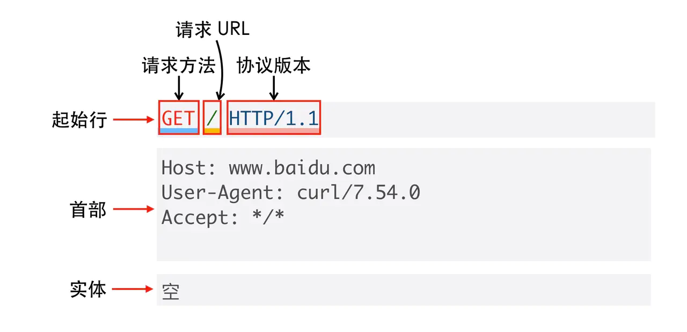

> 如需转载，请附上链接：[https://jwcen.github.io/](https://jwcen.github.io/)
{: .prompt-tip}

* This will become a table of contents (this text will be scrapped).
{:toc}

## HTTP 
HTTP 是超文本传输协议，也就是HyperText Transfer Protocol。  
HTTP 是一个在计算机世界里专门在「两点」之间「传输」文字、图片、音频、视频等「超文本」数据的「约定和规范」。
拆成三个部分：
- 超文本：HTTP 传输的内容是「超文本」。
- 传输：A->B, B-> A；允许中间有中转或接力。
- 协议：一种计算机之间交流通信的规范。

### HTTP 报文 
http 报文大概分三部分：**起始行、首部、实体。**

_http请求报文格式_

### HTTP 常见首部字段

| Header         | 作用                                            |
| -------------- | ----------------------------------------------- |
| Host           | 客户端发送请求时，用来指定服务器的域名          |
| Content-Length | 服务器回应时，告诉客户端，本次数据是什么格式    |
| Connection     | 最常用于客户端要求服务器使用「HTTP 长连接」机制 |

### HTTP 状态码

- 100 继续 – 现在一切正常，继续。
- **101 切换协议** – 有消息，例如升级请求、正在将事物更改为不同的协议。
- 102 处理 – 正在发生但尚未完成。



- 200 请求成功，有响应体
- 201 已创建 — 与 200 类似，但衡量成功的标准是创建了新资源。
- 204 无内容 — 请求已发送，但正文中没有内容。
- 205 重置内容 — 将文档重置为原始状态，例如，清除表单。
- 206 部分内容 — 只发送了部分内容。



- **301 永久跳转** – 旧资源现在重定向到新的资源上。（会缓存）
- **302 临时跳转** – 旧资源现在临时重定向到新资源。（不缓存）
- **304 无修改** – 表示页面没有被修改。通常用于缓存。



- 400 客户端请求的语法错误
- **401 未认证响应**：是由于用户没有进行身份认证或者身份认证不对。
- **403 拒绝响应**：是当用户通过了身份验证，但无权对给定资源执行请求的操作（比如没有读写权限）。



- **500 内部服务器错误** – 服务器遇到某种问题、并且没有更好或更具体的错误代码。
- 501 无法实现 – 服务器不支持请求方法。
- **502 网关错误** – 服务器处于请求中间状态。但是它从它路由到的服务器收到了错误的响应。
- 503 暂停服务 – 服务器因维护而过载或停机，现在无法处理请求。它可能很快就会恢复。
- **504 网关超时** – 服务器处于请求中间状态。但是没有收到来自它路由到的服务器的及时响应。


### HTTP请求方法

| 方法    | 说明                                                                                                                    |
| ------- | ----------------------------------------------------------------------------------------------------------------------- |
| GET     | **请求指定的资源**，一般用于数据的读取                                                                                  |
| HEAD    | 与GET方法一样，服务器不会回传响应主体。  场景：客户端查看服务器的性能；检查文件是否存在/最新版本                        |
| POST    | **向指定资源提交数据，请求服务器进行处理**，  如：表单数据提交、文件上传等，请求数据会被包含在请求体中。                |
| PUT     | 向指定资源位置上传其最新内容                                                                                            |
| PATCH   | 与PUT请求类似，同样用于资源的更新。                                                                                     |
| DELETE  | 用于请求服务器删除所请求URI所标识的资源                                                                                 |
| CONNECT | HTTP/1.1协议预留的，能够将连接改为管道方式的代理服务器。  用于SSL加密服务器的链接 与 非加密的HTTP代理服务器之间的通信。 |
| OPTIONS | 与HEAD类似，一般也是用于客户端查看服务器的性能。                                                                        |
| TRACE   | 服务器会将通信路径返回给客户端。用于HTTP请求的测试或诊断。                                                              |

> 安全和幂等的概念：
> - 在 HTTP 协议里，所谓的「安全」是指**请求方法不会「破坏」服务器上的资源。**
> - 所谓的「幂等」，意思是**多次执行相同的操作，结果都是「相同」的。**
{: .prompt-tip}


-  **语义**。
   -  GET是请求获取指定的资源
   -  POST 是向指定资源提交数据，请求服务器进行处理
- **传参方式**。
  - GET 通过 query URL或Cookie传参
  - POST将数据放在body中（HTTP协议用法的约定）。
- **提交的数据大小**。
  - GET 可提交的数据量受到URL长度的限制（特定的浏览器及服务器对它的限制，HTTP 没有对其限制）
  - POST 是没有大小限制的（安全考虑，服务器软件实现时会做限制）。
- 安全和幂等性。
  - GET 请求是安全和幂等的。POST请求不是。



都是向服务器端发送数据的。  
区别：
- PUT、PATCH 请求是幂等的，POST 不是
- PUT 更新数据时是全部更新，PATCH 只进行部分更新，POST 的话会创建新的内容


### HTTP 缓存技术
浏览器缓存是浏览器对之前请求过的文件进行缓存，以便下一次访问时重复使用，减少带宽、服务器压力，加快网页响应速度。

HTTP/1.0 提出缓存概念，即强缓存 `Expires` 和协商缓存 `Last-Modified`。后 HTTP/1.1 又有了更好的方案，即**强缓存 `Cache-Control` 和协商缓存 `ETag`**。

缓存相关的请求/响应头  

|       Header             |           作用         |
| ------ | ------ |
| Expires | 响应头，代表该资源的过期时间。  |
| Cache-Control | 请求/响应头，缓存控制字段，精确控制缓存策略。  |
| If-Modified-Since | 请求头，资源最近修改时间，由浏览器告诉服务器。  |
| Last-Modified | 响应头，资源最近修改时间，由服务器告诉浏览器。  |
| Etag | 响应头，资源标识，由服务器告诉浏览器。  |
| If-None-Match | 请求头，缓存资源标识，由浏览器告诉服务器。  |

#### 强制缓存和协商缓存

- 强制缓存
  - 只要浏览器判断**缓存没有过期，则直接使用本地缓存**，决定是否使用缓存的主动性在于浏览器这边。
  - 通过设置`Expires`和`Cache-Control`(优先级更高) 两种响应头实现
    - Expires: 绝对时间, 客户端与服务端的时间时差或误差等因素可能造成客户端与服务端的时间不一致。
    - Cache-Control: 相对时间，它解决了绝对时间的带来的问题。`Cache-Control: max-age=315360000`
- 协商缓存就得和服务器协商确认下这个缓存能不能用。
  - 由 `Last-Modified` / `IfModified-Since`， `Etag` /`If-None-Match`实现
  - 每次请求需要让服务器判断一下资源是否更新过，从而决定浏览器是否使用缓存，如果是，则返回 304，否则重新完整响应。

> 强缓存作用于那些不怎么变化的资源(如js，css等)，协商缓存适用常更新的文件(如 html)。

## HTTP/1.0, 1.1, 2.0, 3.0
### HTTP/1.0
HTTP/0.9 非常有限，没有 HTTP 首部，也没有状态或错误代码，只能传输 HTML 文件。就有了更加通用的 HTTP/1.0：
- 在每个请求中都会发送版本控制信息 `GET / HTTP/1.0`
- 在响应开始时还会发送状态代码行。`200 OK`
- 引入了首部字段，如 `Content-Type`，可以传输纯 HTML 文件以外的文档。
- 提供了简单的缓存机制。通过首部的`If-Modified-Since`,`Expires` 来做为缓存判断的标准。

**缺点:**
- **默认使用短连接。** 每次请求建立 TCP 连接，服务完成立即断开，开销大（`Connection: keep-alive` 强制开启长连接）。
- 错误状态响应码少。16种。
- 缓存机制简单。
- HTTP层队头阻塞。下一个请求必须在前一个请求响应到达之后才能发送。

### HTTP/1.1
HTTP1.1 是 HTTP 的第一个标准化版本，继承了 1.0 的简单，并引入了许多改进：
- **默认开启长连接**。连接可以重复使用，从而节省了时间。
- **添加了管道机制**。这允许在第一个请求的响应完成传输之前发送第二个请求。这降低了通信的延迟。
- 支持分块传输编码。服务端每产生一块数据，就发送一块，用” 流模式” 取代” 缓存模式”。`transfer-encoding:chunked` ，最后一块字节数为 0.
- 更多的[缓存控制机制](https://jwcen.github.io/posts/computer-network/HTTP-HTTPS.html#http-缓存技术)。
- `Host` 首部字段，使得一个服务器能够用来创建多个Web站点。（可能多个虚拟主机共享同一ip地址）

**HTTP/1.1 瓶颈**：
- 头部（Header）未经压缩就发送，首部信息越多延迟越大，只能压缩 Body 的部分；
- 发送冗长的首部。每次互相发送相同的首部造成的浪费较多；
- 没有解决响应的 **HTTP 层队头阻塞**问题。（服务器是按请求的顺序响应的）
- 没有请求优先级控制；
- 请求只能从客户端开始，服务器只能被动响应。

### HTTP/2.0
HTTP/2 是 HTTP 协议自 1999 年 HTTP 1.1 发布后的首个更新，主要基于 SPDY 协议。
HTTP/2 为了解决 HTTP/1.1 中仍然存在的效率问题。相比 HTTP/1.x 多的新特性：
- **二进制格式**。
  - 1.x 版本的头信息是纯文本（ASCII 编码），数据体可以是文本或者二进制；
  - 2.0 中，头信息和数据体都是二进制，统称为帧。这增加了数据传输的效率。
- **header压缩**。
  - 1.x 的 header 带有大量信息，而且每次都要重复发送； 
  - 2.0使用 encoder 来减少需要传输的header 大小，通信双方维护一张头信息表，既避免了重复 header 的传输，又减小了需要传输的大小。
- **多路复用**。可以通过同一连接发出并行请求。
  - 引出了数据流 Stream 概念，多个 Stream 复用在一条 TCP 连接。
  - 数据流以**消息**的形式发送，而消息又由一个或多个**帧**组成，多个帧之间可以**乱序发送**，因为可根据帧首部的 `Stream ID` **有序组装**成 HTTP 消息。
- 服务器主动推送资源。

> HTTP/2.0 和 SPDY 区别                    
> - HTTP/2.0 支持明文 HTTP 传输，而 SPDY 强制使用 HTTPS
> - HTTP/2.0 消息头的压缩算法采用 [HPACK](http://http2.github.io/http2-spec/compression.html)，而非 SPDY 采用的 [DEFLATE](http://zh.wikipedia.org/wiki/DEFLATE)
{: .prompt-tip}

#### 缺点

### HTTP/3.0 - QUIC

#### 缺点

## HTTPS 

----
参考
> - https://developer.mozilla.org/en-US/docs/Web/HTTP/Basics_of_HTTP/Evolution_of_HTTP

> 如需转载，请附上链接：[https://jwcen.github.io/](https://jwcen.github.io/)
{: .prompt-tip}